<h1>Project #2 TSP Genetic Algorithm</h1>
<h5>Course: CAP4630 001<h5>
<h5>Team Members: Adam Clark, Mahmood Sakib, Quang Le</h5>


<h3>Team Roles</h3>
<body>
<p>
<ul>

<li>Adam Clark - Reporter</li>

<li>Mahmood Sakib - Architecture</li>

<li>Quang Le - Developer</li>
</ul>
</p>
</body>

<h3>Overview</h3>

<body>
The Traveling Salesman Problem (TSP) is about finding the shortest route that visits a list of cities and returns to the starting city. It's a challenging problem with no known fast solution also known as NP-hard, meaning that there is no known polynomial time solution to the problem.However, there are approximate algorithms that can find solutions close to the optimal one such as Ant Colony or Genetic Algorithm. In this project, we will be using the genetic algorithm to solve the TSP problem. The genetic algorithm is a metaheuristic(high-level problem-solving strategies that guide the exploration and exploitation of search spaces to find near-optimal solutions) inspired by the process of natural selection that belongs to the larger class of evolutionary algorithms. The genetic algorithm repeatedly modifies a population of individual solutions. At each step, the genetic algorithm selects individuals at random from the current population to be parents and uses them to produce the children for the next generation. Over successive generations, the population "evolves" toward an optimal solution. Althought there are many variations of the genetic algorithm, they will boil down to these basic step:

1. Initialization - create an initial population
2. Fitness - determine the fitness of each individual in the population
3. Selection - select parents from the population
4. Crossover - create offspring by mating parents
5. Mutation- mutate offspring
6. reapeat 2-5 until terminatal condition is met
<body>

<h3>Preqrequisites</h3>
<body>
Installing matplotlib for graphing the results
</body>

```python

pip install matplotlib 

```

<h3>How were the cities and distances represented (as a data structure)?</h3>

<body>
<p>
 The cities are represented using a dictionary data structure where the keys represent the city numbers and the values are tuples containing the x and y coordinates of each city. This representation allows easy access to the coordinates of a city for distance calculation. Furthermore the distance are calculated using the distance formula square root of (x2-x1)^2 + (y2-y1)^2 which will be use in our fitness fuction later on.
</p>


</body>

<h3>Contribution</h3>
<ul>
<p>
Solution and Data Structure propose by Mahmood Sakib
</p>
<p>
Implementation was done by Adam Clark with the assistance of Quang Le
</p>
</ul>


```python
import random
import math

#generate cities
def generate_cities (n=25, width=200, height=200):
  cities= {}
  random.seed(1) #setting the seed to 1 for reproducibility
  for i in range (n): #generating n cities
    x = random.uniform(0, width)  #random x coordinate 0-200
    y = random.uniform(0, height) #random y coordinate 0-200
    cities[i+1] = (int(x),int(y)) #adding the city to the dictionary
  return cities 

#calculate distance between two cities
def calculate_distance (cityA, cityB): 
  xDis = abs(cityA[0] - cityB[0])
  yDis = abs(cityA[1] - cityB[1])
  return (math.sqrt((xDis**2)+(yDis**2))) #distance between two points formula
```

<h3>How did you encode the solution space?</h3>
<body>
The solution space is encoded as permutations of the cities. Each solution in the population is represented as a list of city numbers, where the order of the numbers determines the sequence of visiting the cities.
</body>
<h3>How did you handle the creation of the initial population?</h3>
<body>
The initial population is created using the <i>create_Initial_Population</i> function. It generates a population of a specified size where each solution is a randomly generated permutation of city numbers. The <i>random.sample</i> function is used to ensure that no city is repeated within a solution.
</body>

<h3>Contribution</h3>
<ul>
<p>
Solution and algorithm propose by Mahmood Sakib
</p>
<p>
Implementation was done by Adam Clark with the assistance of Quang Le
</p>
</ul>


```python
#creating the inital population for the genetic algorithm
def create_Initial_Population (size_population,size_cities):
  population = []
  random.seed() 
  for i in range (size_population): #creating a population of n solutions
      population.append(random.sample(range(1, size_cities+1), size_cities))   #creating a solution of n cities but with no duplicates
  return population
```

<h3>How did you compute the fitness score?</h3>
<body>
the fitness score is computed by calculating the total distance traveled in each solution. The fitness function iterates over each solution in the population. For each solution, it calculates the distance between consecutive cities using the calculate_distance function. If during the iteration get an <i>out of range</i> error it mean that we reach the last city and can calculates the distance from the last city to the inital city we started and sums them up to get the total distance if the last city. The fitness score for each solution is the sum of distances. We also decided to use integers for the fitness score this simplifies comparison of solutions, and the minor loss of precision due to rounding is generally negligible in the context of genetic algorithms, as they typically converge towards an approximate solution rather than the absolute optimal. Therefore, the trade-off between precision and computational efficiency is justified.

<h3>Contribution</h3>
<ul>
<p>
Algorithm propose by Adam Clark
</p>
<p>
Implementation was done by Quang Le
</p>
</ul>


```python
#calculating the fitness of each solution
def fitness (population,cityList):
  fitness_per_solution= [] #list of fitness for per solution
  fitness = [] #list of fitness for each solution
  for i in range (len(population)): #for each solution
    for j in range (len(population[i])):  #for each city in the solution    
      try:
        fitness_per_solution.append(int(calculate_distance(cityList[population[i][j]],cityList[population[i][j+1]]))) #calculating the distance between two cities
      except IndexError:
        fitness_per_solution.append(int(calculate_distance(cityList[population[i][j]],cityList[population[i][0]]))) #calculating the distance between the last city and the first city
    fitness.append(sum(fitness_per_solution)) #summing the distance between all cities in the solution
    fitness_per_solution= [] #list of fitness for per solution
  return fitness  
```

<h3>Which parent selection strategy did you use? Why?</h3>


<body>
<p>
The parent selection strategy used is a simple random selection from the fittest 50% of the population. The selection function randomly selects two parents from the top 50% of solutions with the lowest fitness (shortest distances). This strategy gives a higher chance for better-performing solutions to be selected as parents, promoting the preservation of good traits in the offspring.
</p>
</body>

<h3>Contribution</h3>
<ul>
<p>
Algorithm propose by Quang Le
</p>
<p>
Implementation was done by Sakib Mahmood
</p>
</ul>


```python
#Selecting two parents from the that 50% of the population that have the lowest fitness (distance)
def selection(population,fitness):
  population_fitness = {}
  for i in range (len(population)): #creating a dictionary of the population and their fitness   
    population_fitness[i] = fitness[i]
  fittest_50_percent = [] 
  for i in range (len(population)):
    if population_fitness[i] <= (sum(population_fitness.values())/len(population)): #selecting top 50% of the population
      fittest_50_percent.append(i)
    else:
      pass
  random.seed()#Reset the seeds so we dont get the same value
  parent1= random.choice(fittest_50_percent) #selecting a random parent from the 50% of the population that have the lowest fitness (distance)
  parent2= random.choice(fittest_50_percent) #selecting a random parent from the 50% of the population that have the lowest fitness (distance)
  #validating that the two parents are not the same
  while parent1 == parent2:
    parent2= random.choice(fittest_50_percent) #selecting a random parent from the 50% of the population that have the lowest fitness (distance)
    
  return parent1,parent2
```

<h3>Which crossover strategy(ies) did you try? Which one worked out best?</h3>

<body>
the original thought was using the single point crossover strategy in which we split the parent genes at a certain point and just do a simple swap which can work for less complex problem like the Knapsack problems or Targeted String Problem but a problem occur in which we will have repeating city in the same solution space thus skewing our fitness function additionally will break our parameter for the problem which dictate that we must travel through all cities. To address the issue of having repeated cities in the same solution space and ensure that all cities are visited, After a bit of research we found (Eric Stoltz) solution which used the Order Crossover (OX) breeding method. This method is specifically designed for permutation-based problems such as the Traveling Salesman Problem (TSP). The function performs a random crossover between two parent solutions. It starts by selecting a random range of genes (city numbers) from one parent. The selected genes are then copied to the offspring in the same positions. The remaining genes are filled in the order they appear in the second parent, while ensuring that no duplicates occur. This way, the order of cities is maintained, and all cities are still visited.

<p>
<i>
Parent 1: [1, 2, 3, 4, 5, 6, 7, 8, 9]
Parent 2: [4, 6, 8, 9, 2, 7, 5, 1, 3]

Generate two random indices, geneA and geneB, within the length of the parent solutions. These indices determine the crossover range.

For example, let's say geneA is 3 and geneB is 7.

Determine the starting and ending points for the crossover range.

startGene is the minimum value between geneA and geneB: 3.
endGene is the maximum value between geneA and geneB: 7.
Create the child solution childP1 by copying the genes within the crossover range from Parent 1.

childP1: [4, 5, 6]
Generate the child solution childP2 by adding the genes from Parent 2 that are not already in childP1. Maintain the order of the genes from Parent 2.

childP2: [8, 9, 2, 7, 1, 3]
Note: The genes 4, 5, and 6 are not added to childP2 since they are already present in childP1.

Combine childP1 and childP2 to create the final child solution.

Child Solution: [4, 5, 6, 8, 9, 2, 7, 1, 3]
</i>
</p>
</body>


<h3>Contribution</h3>
<ul>
<p>
Solution and algorithm propose by Sakib Mahmood
</p>
<p>
Implementation was done by Adam Clark 
</p>
</ul>


```python
#Order cross over breeding
def order_crossover_breed (Parent1,Parent2):
  childP1 = [] #child solution from parent 1
  childP2 = [] #child solution from parent 2
  random.seed() #Reset the seeds so we dont get the same value
  geneA = int(random.random() * len(Parent1)) #creating a random index from parent 1
  geneB = int(random.random() * len(Parent1)) #creating a random index from parent 1
  startGene = min(geneA, geneB) #selecting the least index as the starting point
  endGene = max(geneA, geneB) #selecting the highest index as the ending point
  for i in range(startGene, endGene): #for each gene in the selected range
    childP1.append(Parent1[i]) #adding the gene to the child solution from parent 1
  childP2 = [item for item in Parent2 if item not in childP1] #adding the gene to the child solution from parent 2 that are not already in the child solution from parent 1
  child = childP1 + childP2 #adding the two child solutions together
  return child
```

<h3>Which mutation strategy(ies) did you try? Which one worked out best?</h3>

The mutation strategy used is a simple swap mutation. The mutation function randomly selects a range of genes within a solution and swaps their positions with a certain probability (mutation rate). This introduces random changes in the solutions and helps explore different areas of the search space.


Solution 1: [1, 2, 3, 4, 5]

1.Randomly Selecting the Range of Genes: let's assume that geneA = 0 and geneB = 1. This means the selected range for mutation is from the first gene to the second gene.

2.Swapping the Genes: The genes in the selected range are swapped.
  Let's assume that randomSpot = 1 and randomSpot2 = 3. We swap the values at these positions within 
  Solution 1: [1, 4, 3, 2, 5]

3.Returning the Mutated Solution: The mutated solution is returned.
  Solution 1: [1, 4, 3, 2, 5]

<h3>Contribution</h3>
<ul>
<p>
Algorithm propose by Mahmood Sakib
</p>
<p>
Implementation was done by Quang Le
</p>
</ul>


```python
def mutation(population, mutation_rate = 0.05):
  geneA = int(random.random() * len(population)) #creating a random index from parent 1
  geneB = int(random.random() * len(population)) #creating a random index from parent 2
  startGene = min(geneA, geneB) #selecting the least index as the starting point
  endGene = max(geneA, geneB) #selecting the highest index as the ending point 
  random.seed()
  if (random.random() < mutation_rate): # Only mutate if the random number is less than mutation rate
    for i in range(startGene, endGene): #for each gene in the selected range
            randomSpot = random.randint(0, len(population[i])-1)
            randomSpot2 = random.randint(0, len(population[i])-1)
            population[i][randomSpot],population[i][randomSpot2] = population[i][randomSpot2],population[i][randomSpot] #swapping the genes
  return population
```

<h3>Which strategy did you use for populating the next generation? Why?</h3>

<body>
<p1>
The next generation is populated by applying the parent selection, crossover, mutation is also applied but after new_population is return in evolution. The generate_new_population function selects parents, performs crossover breeding using the OX method, and produces new offspring solutions. It also applies elitism by preserving the two fittest parents from the current population in the new population. This strategy helps maintain the best solutions from the previous generation while introducing diversity through crossover and mutation. The best_fitness function is use to return the lowest distance achieve for each generation.
</p1>
</body>


<h3>Contribution</h3>
<ul>
<p>
Solution and algorithm propose by Mahmood Sakib
</p>
<p>
Implementation was done by Adam Clark with the assistance of Quang Le
</p>
</ul>


```python
#create a new population of n-2 solutions by breeding the fittest 50% of the population
def generate_new_population (population,fitness,eliteSize):
  new_population = []
  for i in range (len(population)-eliteSize): #creating a new population of n-2 solutions
    parent1,parent2 = selection(population,fitness)
    new_population.append(order_crossover_breed(population[parent1],population[parent2]))
  #picking the two fittest parents and adding them to the new population (elitism)
  population_fitness = {}
  for i in range (len(population)): #creating a dictionary of the population and their fitness
    population_fitness[i] = fitness[i]
  population_fitness = sorted(population_fitness.items(), key=lambda x: x[1]) #sorting the population by fitness (distance)
  for i in range (eliteSize):
    new_population.append(population[population_fitness[i][0]]) #adding the fittest parent to the new population
  return new_population

def best_fitness(population,fitness):
  population_fitness = {}
  for i in range (len(population)): #creating a dictionary of the population and their fitness
    population_fitness[i] = fitness[i]
  population_fitness = sorted(population_fitness.items(), key=lambda x: x[1]) #sorting the population by fitness (distance)
  return population[population_fitness[0][0]],population_fitness[0][1] #returning the fittest solution and its fitness (distance)

def evolution(population,fitnessArray,mutation_rate,cityList,eliteSize):
  new_population = generate_new_population(population,fitnessArray,eliteSize)
  mutated_population = mutation(new_population,mutation_rate)
  fitnessArray = fitness(mutated_population,cityList)
  bestSolution, bestDistance = best_fitness(mutated_population, fitnessArray)
  return mutated_population, fitnessArray, bestSolution, bestDistance


```

<h3>Which stopping criteria did you use? Why?</h3>
<body>
<p>
The stopping criteria used is a maximum number of generations. The algorithm runs for a specified number of generations and stops when the maximum number of generations is reached or if the last 300 generation has no change. This ensures that the algorithm does not run indefinitely and that the best solution is returned after a certain number of iterations. (Note: This is possible because of our roundings of the fitness function.)
</p>
</body>
<h3>What other parameters, design choices, initialization and configuration steps are relevant to your design and implementation?</h3>
<body>
<ul>
  <li><code>city_list</code>: A list of city coordinates</li>
  <li><code>cities</code>: The number of cities that will be generated</li>
  <li><code>population</code>: The number of solutions in each generation</li>
  <li><code>max_generations</code>: The maximum number of generations to run the algorithm</li>
  <li><code>mutation_rate</code>: The probability of mutation</li>
  <li><code>EliteSize</code>: The number of fittest parents to preserve in the next generation</li>
</ul>
</body>

<h3>Contribution</h3>
<ul>
<p>
Algorithm propose Quang Le
</p>
<p>
Implementation was done by Adam Clark with the assistance of Sakib Mahmood
</p>
</ul>


```python
if __name__ == "__main__":
  cities = 25
  population = 100
  generation  = 0
  max_generations = math.inf
  mutation_rate = 0.05
  eliteSize= 5
  cityList = generate_cities(cities)
  
  
  print(f"Cities: {cities} Population: {population} Generations: {max_generations} Mutation Rate: {mutation_rate*100}% Elite Size= {eliteSize} \n\n\n")
  population = create_Initial_Population(population,cities)
  fitnessArray = fitness(population,cityList)
  bestSolution, bestDistance = best_fitness(population, fitnessArray)
  print(f"Generation 0: Best Solution: {bestSolution} Best Distance: {bestDistance}")

  DistanceList = []
  while generation < max_generations:
      population, fitnessArray, bestSolution, bestDistance = evolution(population, fitnessArray, mutation_rate,cityList,eliteSize)
      print(f"Generation {generation+1}: Best Solution: {bestSolution} Best Distance: {bestDistance}")
      
      # Add the new bestDistance to the list
      DistanceList.append(bestDistance)

      # If there are more than 300 distances in the list, remove the oldest one
      if len(DistanceList) > 300:
          DistanceList.pop(0)
      
      # Check if all distances in the list are the same, but only after 300 generations
      if generation >= 300 and len(set(DistanceList)) == 1:
          print("The best distance didn't change for the last 300 generations")
          break

      generation += 1
```

    Cities: 25 Population: 100 Generations: inf Mutation Rate: 5.0% Elite Size= 5 
    
    
    
    Generation 0: Best Solution: [5, 18, 19, 24, 23, 25, 10, 20, 2, 4, 3, 1, 9, 16, 21, 8, 11, 22, 13, 17, 14, 15, 12, 6, 7] Best Distance: 1976
    Generation 1: Best Solution: [5, 18, 19, 24, 23, 25, 10, 20, 2, 4, 3, 1, 9, 16, 21, 8, 11, 22, 13, 17, 14, 15, 12, 6, 7] Best Distance: 1976
    Generation 2: Best Solution: [5, 18, 19, 24, 23, 25, 10, 20, 2, 4, 3, 1, 9, 16, 21, 8, 11, 22, 13, 17, 14, 15, 12, 6, 7] Best Distance: 1976
    Generation 3: Best Solution: [2, 10, 25, 24, 12, 6, 21, 5, 9, 17, 15, 18, 22, 16, 14, 11, 23, 4, 19, 8, 1, 3, 13, 20, 7] Best Distance: 1958
    Generation 4: Best Solution: [22, 11, 5, 7, 10, 25, 12, 23, 19, 21, 6, 4, 8, 13, 1, 17, 16, 18, 20, 2, 24, 14, 9, 3, 15] Best Distance: 1912
    Generation 5: Best Solution: [8, 1, 3, 13, 11, 16, 18, 20, 2, 10, 7, 15, 12, 19, 21, 25, 24, 6, 4, 23, 17, 5, 9, 14, 22] Best Distance: 1794
    Generation 6: Best Solution: [11, 17, 13, 5, 16, 18, 20, 2, 10, 25, 24, 12, 3, 21, 4, 23, 19, 6, 7, 15, 1, 9, 14, 8, 22] Best Distance: 1689
    Generation 7: Best Solution: [11, 17, 13, 5, 16, 18, 20, 2, 10, 25, 24, 12, 3, 21, 4, 23, 19, 6, 7, 15, 1, 9, 14, 8, 22] Best Distance: 1689
    Generation 8: Best Solution: [22, 14, 7, 15, 17, 11, 13, 5, 16, 18, 20, 2, 10, 25, 24, 12, 3, 21, 4, 23, 19, 6, 1, 9, 8] Best Distance: 1672
    Generation 9: Best Solution: [1, 9, 8, 13, 11, 16, 18, 20, 2, 10, 25, 24, 12, 3, 21, 4, 23, 19, 6, 7, 15, 17, 5, 14, 22] Best Distance: 1552
    Generation 10: Best Solution: [17, 13, 22, 14, 5, 18, 7, 15, 3, 20, 2, 10, 25, 24, 12, 21, 4, 23, 19, 6, 11, 16, 9, 8, 1] Best Distance: 1534
    Generation 11: Best Solution: [14, 5, 18, 7, 15, 3, 20, 2, 10, 25, 24, 12, 21, 4, 23, 19, 6, 11, 16, 1, 9, 8, 22, 13, 17] Best Distance: 1528
    Generation 12: Best Solution: [14, 5, 18, 7, 15, 3, 20, 2, 10, 25, 24, 12, 21, 4, 23, 19, 6, 11, 16, 1, 9, 8, 22, 13, 17] Best Distance: 1528
    Generation 13: Best Solution: [14, 5, 18, 7, 15, 3, 20, 2, 10, 25, 24, 12, 21, 4, 23, 19, 6, 11, 16, 1, 9, 8, 22, 13, 17] Best Distance: 1528
    Generation 14: Best Solution: [20, 2, 10, 7, 15, 12, 19, 21, 25, 24, 6, 4, 23, 3, 16, 18, 17, 14, 5, 13, 11, 1, 9, 8, 22] Best Distance: 1513
    Generation 15: Best Solution: [22, 14, 5, 18, 7, 15, 3, 20, 2, 10, 12, 25, 24, 21, 4, 23, 19, 6, 11, 16, 1, 9, 8, 13, 17] Best Distance: 1463
    Generation 16: Best Solution: [22, 14, 5, 18, 7, 15, 3, 20, 2, 10, 12, 25, 24, 21, 4, 23, 19, 6, 11, 17, 13, 16, 1, 9, 8] Best Distance: 1463
    Generation 17: Best Solution: [22, 14, 5, 18, 7, 15, 3, 20, 2, 10, 12, 25, 24, 21, 4, 23, 19, 6, 11, 17, 13, 16, 1, 9, 8] Best Distance: 1463
    Generation 18: Best Solution: [22, 14, 5, 18, 7, 15, 3, 20, 2, 10, 12, 25, 24, 21, 4, 23, 19, 6, 11, 17, 13, 16, 1, 9, 8] Best Distance: 1463
    Generation 19: Best Solution: [22, 14, 5, 18, 7, 15, 3, 20, 2, 10, 25, 24, 12, 21, 4, 23, 19, 6, 16, 11, 1, 9, 8, 13, 17] Best Distance: 1380
    Generation 20: Best Solution: [22, 14, 5, 18, 7, 15, 3, 20, 2, 10, 25, 24, 12, 21, 4, 23, 19, 6, 16, 11, 1, 9, 8, 13, 17] Best Distance: 1380
    Generation 21: Best Solution: [22, 14, 5, 18, 7, 15, 3, 20, 2, 10, 25, 24, 12, 21, 4, 23, 19, 6, 16, 11, 1, 9, 8, 13, 17] Best Distance: 1380
    Generation 22: Best Solution: [22, 14, 5, 18, 7, 15, 3, 20, 2, 10, 25, 24, 12, 21, 4, 23, 19, 6, 16, 11, 1, 9, 8, 13, 17] Best Distance: 1380
    Generation 23: Best Solution: [22, 14, 5, 18, 7, 15, 3, 20, 2, 10, 25, 24, 12, 21, 4, 23, 19, 6, 16, 11, 1, 9, 8, 13, 17] Best Distance: 1380
    Generation 24: Best Solution: [25, 24, 12, 21, 4, 23, 19, 6, 20, 2, 10, 7, 5, 18, 16, 1, 9, 8, 15, 14, 11, 22, 13, 17, 3] Best Distance: 1330
    Generation 25: Best Solution: [25, 24, 12, 21, 4, 23, 19, 6, 20, 2, 10, 7, 5, 18, 16, 22, 11, 1, 9, 17, 13, 14, 15, 3, 8] Best Distance: 1266
    Generation 26: Best Solution: [25, 24, 12, 21, 4, 23, 19, 6, 20, 2, 10, 7, 5, 18, 16, 22, 11, 1, 9, 17, 13, 14, 15, 3, 8] Best Distance: 1266
    Generation 27: Best Solution: [25, 24, 12, 21, 4, 23, 19, 6, 20, 2, 10, 7, 5, 18, 16, 22, 11, 1, 9, 17, 13, 14, 15, 3, 8] Best Distance: 1266
    Generation 28: Best Solution: [25, 24, 12, 21, 4, 23, 19, 6, 20, 2, 10, 7, 5, 18, 16, 22, 11, 1, 9, 17, 13, 14, 15, 3, 8] Best Distance: 1266
    Generation 29: Best Solution: [25, 24, 12, 21, 4, 23, 19, 6, 20, 2, 10, 7, 5, 18, 16, 22, 11, 1, 9, 17, 13, 14, 15, 3, 8] Best Distance: 1266
    Generation 30: Best Solution: [25, 24, 12, 21, 4, 23, 19, 6, 20, 2, 10, 7, 5, 18, 16, 22, 11, 1, 9, 17, 13, 14, 15, 3, 8] Best Distance: 1266
    Generation 31: Best Solution: [25, 24, 12, 21, 4, 23, 19, 6, 20, 2, 10, 7, 15, 3, 17, 13, 22, 14, 5, 18, 16, 11, 1, 9, 8] Best Distance: 1157
    Generation 32: Best Solution: [25, 24, 12, 21, 4, 23, 19, 6, 20, 2, 10, 7, 15, 3, 17, 13, 22, 14, 5, 18, 16, 11, 1, 9, 8] Best Distance: 1157
    Generation 33: Best Solution: [25, 24, 12, 21, 4, 23, 19, 6, 20, 2, 10, 7, 15, 3, 17, 13, 22, 14, 5, 18, 16, 11, 1, 9, 8] Best Distance: 1157
    Generation 34: Best Solution: [25, 24, 12, 21, 4, 23, 19, 6, 20, 2, 10, 7, 15, 3, 17, 13, 22, 14, 5, 18, 16, 11, 1, 9, 8] Best Distance: 1157
    Generation 35: Best Solution: [25, 24, 12, 21, 4, 23, 19, 6, 20, 2, 10, 7, 15, 3, 17, 13, 22, 14, 5, 18, 16, 11, 1, 9, 8] Best Distance: 1157
    Generation 36: Best Solution: [25, 24, 12, 21, 4, 23, 19, 6, 20, 2, 10, 7, 15, 3, 17, 13, 22, 14, 5, 18, 16, 11, 1, 9, 8] Best Distance: 1157
    Generation 37: Best Solution: [25, 24, 12, 21, 4, 23, 19, 6, 20, 2, 10, 7, 15, 3, 17, 13, 22, 14, 5, 18, 16, 11, 1, 9, 8] Best Distance: 1157
    Generation 38: Best Solution: [25, 24, 12, 21, 4, 23, 19, 6, 20, 2, 10, 7, 15, 3, 17, 13, 22, 14, 5, 18, 16, 11, 1, 9, 8] Best Distance: 1157
    Generation 39: Best Solution: [25, 24, 12, 21, 4, 23, 19, 6, 20, 2, 10, 7, 15, 3, 17, 13, 22, 14, 5, 18, 16, 11, 1, 9, 8] Best Distance: 1157
    Generation 40: Best Solution: [25, 24, 12, 21, 4, 23, 19, 6, 20, 2, 10, 7, 15, 3, 17, 13, 22, 14, 5, 18, 16, 11, 1, 9, 8] Best Distance: 1157
    Generation 41: Best Solution: [21, 4, 23, 19, 25, 24, 12, 6, 20, 2, 10, 7, 15, 3, 17, 13, 22, 14, 5, 18, 16, 11, 1, 9, 8] Best Distance: 1117
    Generation 42: Best Solution: [21, 4, 23, 19, 25, 24, 12, 6, 20, 2, 10, 7, 15, 3, 17, 13, 22, 14, 5, 18, 16, 11, 1, 9, 8] Best Distance: 1117
    Generation 43: Best Solution: [6, 20, 2, 10, 7, 3, 17, 13, 22, 14, 5, 18, 16, 11, 1, 9, 8, 15, 25, 21, 4, 23, 19, 24, 12] Best Distance: 1110
    Generation 44: Best Solution: [15, 3, 25, 21, 4, 23, 19, 24, 12, 6, 20, 2, 10, 7, 17, 13, 22, 14, 5, 18, 16, 11, 1, 9, 8] Best Distance: 1101
    Generation 45: Best Solution: [4, 23, 19, 24, 12, 6, 20, 2, 10, 7, 15, 3, 17, 13, 22, 14, 5, 18, 16, 11, 1, 9, 8, 25, 21] Best Distance: 1086
    Generation 46: Best Solution: [25, 21, 4, 23, 19, 24, 12, 6, 20, 2, 10, 7, 15, 3, 17, 13, 22, 14, 5, 18, 16, 11, 1, 9, 8] Best Distance: 1086
    Generation 47: Best Solution: [25, 21, 4, 23, 19, 24, 12, 6, 20, 2, 10, 7, 15, 3, 17, 13, 22, 14, 5, 18, 16, 11, 1, 9, 8] Best Distance: 1086
    Generation 48: Best Solution: [25, 21, 4, 23, 19, 24, 12, 6, 20, 2, 10, 7, 15, 3, 17, 13, 22, 14, 5, 18, 16, 11, 1, 9, 8] Best Distance: 1086
    Generation 49: Best Solution: [23, 19, 24, 12, 6, 20, 2, 10, 7, 15, 3, 17, 13, 22, 14, 5, 18, 16, 11, 1, 9, 8, 25, 21, 4] Best Distance: 1086
    Generation 50: Best Solution: [25, 21, 4, 23, 19, 24, 12, 6, 20, 2, 10, 7, 15, 3, 17, 13, 22, 14, 5, 18, 16, 11, 1, 9, 8] Best Distance: 1086
    Generation 51: Best Solution: [9, 8, 25, 21, 4, 23, 19, 24, 12, 6, 20, 2, 10, 7, 15, 3, 17, 13, 22, 14, 5, 18, 16, 11, 1] Best Distance: 1086
    Generation 52: Best Solution: [21, 4, 23, 19, 24, 12, 6, 20, 2, 10, 7, 15, 3, 17, 13, 22, 14, 5, 18, 16, 11, 1, 9, 8, 25] Best Distance: 1086
    Generation 53: Best Solution: [18, 16, 11, 1, 9, 8, 25, 21, 4, 23, 19, 24, 12, 6, 20, 2, 10, 7, 15, 3, 17, 13, 22, 14, 5] Best Distance: 1086
    Generation 54: Best Solution: [23, 19, 24, 12, 6, 10, 7, 20, 2, 15, 3, 17, 13, 22, 14, 5, 18, 16, 11, 1, 9, 8, 25, 21, 4] Best Distance: 1058
    Generation 55: Best Solution: [23, 19, 24, 12, 6, 10, 7, 20, 2, 15, 3, 17, 13, 22, 14, 5, 18, 16, 11, 1, 9, 8, 25, 21, 4] Best Distance: 1058
    Generation 56: Best Solution: [23, 19, 24, 12, 6, 10, 7, 20, 2, 15, 3, 17, 13, 22, 14, 5, 18, 16, 11, 1, 9, 8, 25, 21, 4] Best Distance: 1058
    Generation 57: Best Solution: [23, 19, 24, 12, 6, 10, 7, 20, 2, 15, 3, 17, 13, 22, 14, 5, 18, 16, 11, 1, 9, 8, 25, 21, 4] Best Distance: 1058
    Generation 58: Best Solution: [23, 19, 24, 12, 6, 10, 7, 20, 2, 15, 3, 17, 13, 22, 14, 5, 18, 16, 11, 1, 9, 8, 25, 21, 4] Best Distance: 1058
    Generation 59: Best Solution: [19, 24, 12, 6, 10, 7, 20, 2, 15, 3, 17, 13, 22, 14, 5, 18, 16, 11, 1, 9, 8, 25, 21, 4, 23] Best Distance: 1058
    Generation 60: Best Solution: [23, 19, 24, 12, 6, 10, 7, 20, 2, 15, 3, 17, 13, 22, 14, 5, 18, 16, 11, 1, 9, 8, 25, 21, 4] Best Distance: 1058
    Generation 61: Best Solution: [5, 18, 16, 11, 1, 9, 8, 25, 21, 4, 23, 19, 24, 12, 6, 10, 7, 20, 2, 15, 3, 17, 13, 22, 14] Best Distance: 1058
    Generation 62: Best Solution: [5, 18, 16, 11, 1, 9, 8, 25, 21, 4, 23, 19, 24, 12, 6, 10, 7, 20, 2, 15, 3, 17, 13, 22, 14] Best Distance: 1058
    Generation 63: Best Solution: [13, 22, 14, 5, 18, 16, 11, 1, 9, 8, 25, 21, 4, 23, 19, 24, 12, 6, 10, 7, 20, 2, 15, 3, 17] Best Distance: 1058
    Generation 64: Best Solution: [4, 23, 25, 21, 19, 24, 12, 6, 20, 2, 10, 7, 15, 3, 17, 13, 22, 14, 5, 18, 16, 11, 1, 9, 8] Best Distance: 1035
    Generation 65: Best Solution: [4, 23, 25, 21, 19, 24, 12, 6, 20, 2, 10, 7, 15, 3, 17, 13, 22, 14, 5, 18, 16, 11, 1, 9, 8] Best Distance: 1035
    Generation 66: Best Solution: [4, 23, 25, 21, 19, 24, 12, 6, 20, 2, 10, 7, 15, 3, 17, 13, 22, 14, 5, 18, 16, 11, 1, 9, 8] Best Distance: 1035
    Generation 67: Best Solution: [4, 23, 25, 21, 19, 24, 12, 6, 20, 2, 10, 7, 15, 3, 17, 13, 22, 14, 5, 18, 16, 11, 1, 9, 8] Best Distance: 1035
    Generation 68: Best Solution: [13, 22, 14, 5, 18, 16, 11, 1, 9, 8, 4, 23, 25, 21, 19, 24, 12, 6, 10, 7, 20, 2, 15, 3, 17] Best Distance: 1007
    Generation 69: Best Solution: [3, 17, 13, 22, 14, 5, 18, 16, 11, 1, 9, 8, 4, 23, 25, 21, 19, 24, 12, 6, 10, 7, 20, 2, 15] Best Distance: 1007
    Generation 70: Best Solution: [22, 14, 5, 18, 16, 13, 11, 1, 9, 8, 4, 23, 25, 21, 19, 24, 12, 6, 10, 7, 20, 2, 3, 15, 17] Best Distance: 986
    Generation 71: Best Solution: [22, 14, 5, 18, 16, 13, 11, 1, 9, 8, 4, 23, 25, 21, 19, 24, 12, 6, 10, 7, 20, 2, 3, 15, 17] Best Distance: 986
    Generation 72: Best Solution: [22, 14, 5, 18, 16, 13, 11, 1, 9, 8, 4, 23, 25, 21, 19, 24, 12, 6, 10, 7, 20, 2, 3, 15, 17] Best Distance: 986
    Generation 73: Best Solution: [7, 20, 2, 3, 15, 17, 13, 22, 14, 5, 18, 16, 11, 1, 9, 8, 4, 23, 25, 21, 19, 24, 12, 6, 10] Best Distance: 980
    Generation 74: Best Solution: [9, 8, 4, 23, 25, 21, 19, 24, 12, 6, 10, 7, 20, 2, 3, 15, 17, 13, 22, 14, 5, 18, 16, 11, 1] Best Distance: 980
    Generation 75: Best Solution: [9, 8, 4, 23, 25, 21, 19, 24, 12, 6, 10, 7, 20, 2, 3, 15, 17, 13, 22, 14, 5, 18, 16, 11, 1] Best Distance: 980
    Generation 76: Best Solution: [13, 22, 14, 5, 18, 16, 11, 1, 9, 8, 4, 23, 25, 21, 19, 24, 12, 6, 10, 7, 20, 2, 3, 15, 17] Best Distance: 980
    Generation 77: Best Solution: [7, 20, 2, 3, 15, 17, 13, 22, 14, 5, 18, 16, 11, 1, 9, 8, 4, 23, 25, 21, 19, 24, 12, 6, 10] Best Distance: 980
    Generation 78: Best Solution: [9, 8, 4, 23, 25, 21, 19, 24, 12, 6, 10, 7, 20, 2, 3, 15, 17, 13, 22, 14, 5, 18, 16, 11, 1] Best Distance: 980
    Generation 79: Best Solution: [13, 22, 14, 5, 18, 16, 11, 1, 9, 8, 4, 23, 25, 21, 19, 24, 12, 6, 10, 7, 20, 2, 3, 15, 17] Best Distance: 980
    Generation 80: Best Solution: [19, 24, 12, 6, 10, 7, 20, 2, 3, 15, 17, 13, 22, 14, 5, 18, 16, 11, 1, 9, 8, 4, 23, 25, 21] Best Distance: 980
    Generation 81: Best Solution: [1, 9, 8, 4, 23, 25, 21, 19, 24, 12, 6, 10, 7, 20, 2, 3, 15, 17, 13, 22, 14, 5, 18, 16, 11] Best Distance: 980
    Generation 82: Best Solution: [5, 18, 16, 11, 1, 9, 8, 4, 23, 25, 21, 19, 24, 12, 6, 10, 7, 20, 2, 3, 15, 17, 13, 22, 14] Best Distance: 980
    Generation 83: Best Solution: [20, 2, 3, 15, 17, 13, 22, 14, 5, 18, 16, 11, 1, 9, 8, 4, 23, 25, 21, 19, 24, 12, 6, 10, 7] Best Distance: 980
    Generation 84: Best Solution: [21, 19, 24, 12, 6, 10, 7, 20, 2, 3, 15, 17, 13, 22, 14, 5, 18, 16, 11, 1, 9, 8, 4, 23, 25] Best Distance: 980
    Generation 85: Best Solution: [5, 18, 16, 11, 1, 9, 8, 4, 23, 25, 21, 19, 24, 12, 6, 10, 7, 20, 2, 3, 15, 17, 13, 22, 14] Best Distance: 980
    Generation 86: Best Solution: [17, 13, 22, 14, 5, 18, 16, 11, 1, 9, 8, 4, 23, 25, 21, 19, 24, 12, 6, 10, 7, 20, 2, 3, 15] Best Distance: 980
    Generation 87: Best Solution: [21, 19, 24, 12, 6, 10, 7, 20, 2, 3, 15, 17, 13, 22, 14, 5, 18, 16, 11, 1, 9, 8, 4, 23, 25] Best Distance: 980
    Generation 88: Best Solution: [4, 23, 25, 21, 19, 24, 12, 6, 10, 7, 20, 2, 3, 15, 17, 13, 22, 14, 5, 18, 16, 11, 1, 9, 8] Best Distance: 980
    Generation 89: Best Solution: [4, 23, 25, 21, 19, 24, 12, 6, 10, 7, 20, 2, 3, 15, 17, 13, 22, 14, 5, 18, 16, 11, 1, 9, 8] Best Distance: 980
    Generation 90: Best Solution: [17, 13, 22, 14, 5, 18, 16, 11, 1, 9, 8, 4, 23, 25, 21, 19, 24, 12, 6, 10, 7, 20, 2, 3, 15] Best Distance: 980
    Generation 91: Best Solution: [10, 7, 20, 2, 3, 15, 17, 13, 22, 14, 5, 18, 16, 11, 1, 9, 8, 4, 23, 25, 21, 19, 24, 12, 6] Best Distance: 980
    Generation 92: Best Solution: [4, 23, 25, 21, 19, 24, 12, 6, 10, 7, 20, 2, 3, 15, 17, 13, 22, 14, 5, 18, 16, 11, 1, 9, 8] Best Distance: 980
    Generation 93: Best Solution: [17, 13, 22, 14, 5, 18, 16, 11, 1, 9, 8, 4, 23, 25, 21, 19, 24, 12, 6, 10, 7, 20, 2, 3, 15] Best Distance: 980
    Generation 94: Best Solution: [14, 5, 18, 16, 11, 1, 9, 8, 4, 23, 25, 21, 19, 24, 12, 6, 10, 7, 20, 2, 3, 15, 17, 13, 22] Best Distance: 980
    Generation 95: Best Solution: [21, 19, 24, 12, 6, 10, 7, 20, 2, 3, 15, 17, 13, 22, 14, 5, 18, 16, 11, 1, 9, 8, 4, 23, 25] Best Distance: 980
    Generation 96: Best Solution: [19, 24, 12, 6, 10, 7, 20, 2, 3, 15, 17, 13, 22, 14, 5, 18, 16, 11, 1, 9, 8, 4, 23, 25, 21] Best Distance: 980
    Generation 97: Best Solution: [14, 5, 18, 16, 11, 1, 9, 8, 4, 23, 25, 21, 19, 24, 12, 6, 10, 7, 20, 2, 3, 15, 17, 13, 22] Best Distance: 980
    Generation 98: Best Solution: [3, 15, 17, 13, 22, 14, 5, 18, 16, 11, 1, 9, 8, 4, 23, 25, 21, 19, 24, 12, 6, 10, 7, 20, 2] Best Distance: 980
    Generation 99: Best Solution: [3, 15, 17, 13, 22, 14, 5, 18, 16, 11, 1, 9, 8, 4, 23, 25, 21, 19, 24, 12, 6, 10, 7, 20, 2] Best Distance: 980
    Generation 100: Best Solution: [25, 21, 19, 24, 12, 6, 10, 7, 20, 2, 3, 15, 17, 13, 22, 14, 5, 18, 16, 11, 1, 9, 8, 4, 23] Best Distance: 980
    Generation 101: Best Solution: [10, 7, 20, 2, 3, 15, 17, 13, 22, 14, 5, 18, 16, 11, 1, 9, 8, 4, 23, 25, 21, 19, 24, 12, 6] Best Distance: 980
    Generation 102: Best Solution: [18, 16, 11, 1, 9, 8, 4, 23, 25, 21, 19, 24, 12, 6, 10, 7, 20, 2, 3, 15, 17, 13, 22, 14, 5] Best Distance: 980
    Generation 103: Best Solution: [24, 12, 10, 7, 20, 2, 3, 15, 17, 13, 22, 14, 5, 18, 16, 11, 1, 9, 8, 4, 23, 25, 21, 19, 6] Best Distance: 959
    Generation 104: Best Solution: [24, 12, 10, 7, 20, 2, 3, 15, 17, 13, 22, 14, 5, 18, 16, 11, 1, 9, 8, 4, 23, 25, 21, 19, 6] Best Distance: 959
    Generation 105: Best Solution: [24, 12, 10, 7, 20, 2, 3, 15, 17, 13, 22, 14, 5, 18, 16, 11, 1, 9, 8, 4, 23, 25, 21, 19, 6] Best Distance: 959
    Generation 106: Best Solution: [24, 12, 10, 7, 20, 2, 3, 15, 17, 13, 22, 14, 5, 18, 16, 11, 1, 9, 8, 4, 23, 25, 21, 19, 6] Best Distance: 959
    Generation 107: Best Solution: [24, 12, 10, 7, 20, 2, 3, 15, 17, 13, 22, 14, 5, 18, 16, 11, 1, 9, 8, 4, 23, 25, 21, 19, 6] Best Distance: 959
    Generation 108: Best Solution: [24, 12, 10, 7, 20, 2, 3, 15, 17, 13, 22, 14, 5, 18, 16, 11, 1, 9, 8, 4, 23, 25, 21, 19, 6] Best Distance: 959
    Generation 109: Best Solution: [24, 12, 10, 7, 20, 2, 3, 15, 17, 13, 22, 14, 5, 18, 16, 11, 1, 9, 8, 4, 23, 25, 21, 19, 6] Best Distance: 959
    Generation 110: Best Solution: [24, 12, 10, 7, 20, 2, 3, 15, 17, 13, 22, 14, 5, 18, 16, 11, 1, 9, 8, 4, 23, 25, 21, 19, 6] Best Distance: 959
    Generation 111: Best Solution: [24, 12, 10, 7, 20, 2, 3, 15, 17, 13, 22, 14, 5, 18, 16, 11, 1, 9, 8, 4, 23, 25, 21, 19, 6] Best Distance: 959
    Generation 112: Best Solution: [24, 12, 10, 7, 20, 2, 3, 15, 17, 13, 22, 14, 5, 18, 16, 11, 1, 9, 8, 4, 23, 25, 21, 19, 6] Best Distance: 959
    Generation 113: Best Solution: [24, 12, 10, 7, 20, 2, 3, 15, 17, 13, 22, 14, 5, 18, 16, 11, 1, 9, 8, 4, 23, 25, 21, 19, 6] Best Distance: 959
    Generation 114: Best Solution: [24, 12, 10, 7, 20, 2, 3, 15, 17, 13, 22, 14, 5, 18, 16, 11, 1, 9, 8, 4, 23, 25, 21, 19, 6] Best Distance: 959
    Generation 115: Best Solution: [6, 24, 12, 10, 7, 20, 2, 3, 15, 17, 13, 22, 14, 5, 18, 16, 11, 1, 9, 8, 4, 23, 25, 21, 19] Best Distance: 959
    Generation 116: Best Solution: [6, 24, 12, 10, 7, 20, 2, 3, 15, 17, 13, 22, 14, 5, 18, 16, 11, 1, 9, 8, 4, 23, 25, 21, 19] Best Distance: 959
    Generation 117: Best Solution: [24, 12, 10, 7, 20, 2, 3, 15, 17, 13, 22, 14, 5, 18, 16, 11, 1, 9, 8, 4, 23, 25, 21, 19, 6] Best Distance: 959
    Generation 118: Best Solution: [24, 12, 10, 7, 20, 2, 3, 15, 17, 13, 22, 14, 5, 18, 16, 11, 1, 9, 8, 4, 23, 25, 21, 19, 6] Best Distance: 959
    Generation 119: Best Solution: [24, 12, 10, 7, 20, 2, 3, 15, 17, 13, 22, 14, 5, 18, 16, 11, 1, 9, 8, 4, 23, 25, 21, 19, 6] Best Distance: 959
    Generation 120: Best Solution: [24, 12, 10, 7, 20, 2, 3, 15, 17, 13, 22, 14, 5, 18, 16, 11, 1, 9, 8, 4, 23, 25, 21, 19, 6] Best Distance: 959
    Generation 121: Best Solution: [24, 12, 10, 7, 20, 2, 3, 15, 17, 13, 22, 14, 5, 18, 16, 11, 1, 9, 8, 4, 23, 25, 21, 19, 6] Best Distance: 959
    Generation 122: Best Solution: [24, 12, 10, 7, 20, 2, 3, 15, 17, 13, 22, 14, 5, 18, 16, 11, 1, 9, 8, 4, 23, 25, 21, 19, 6] Best Distance: 959
    Generation 123: Best Solution: [24, 12, 10, 7, 20, 2, 3, 15, 17, 13, 22, 14, 5, 18, 16, 11, 1, 9, 8, 4, 23, 25, 21, 19, 6] Best Distance: 959
    Generation 124: Best Solution: [24, 12, 10, 7, 20, 2, 3, 15, 17, 13, 22, 14, 5, 18, 16, 11, 1, 9, 8, 4, 23, 25, 21, 19, 6] Best Distance: 959
    Generation 125: Best Solution: [24, 12, 10, 7, 20, 2, 3, 15, 17, 13, 22, 14, 5, 18, 16, 11, 1, 9, 8, 4, 23, 25, 21, 19, 6] Best Distance: 959
    Generation 126: Best Solution: [24, 12, 10, 7, 20, 2, 3, 15, 17, 13, 22, 14, 5, 18, 16, 11, 1, 9, 8, 4, 23, 25, 21, 19, 6] Best Distance: 959
    Generation 127: Best Solution: [24, 12, 10, 7, 20, 2, 3, 15, 17, 13, 22, 14, 5, 18, 16, 11, 1, 9, 8, 4, 23, 25, 21, 19, 6] Best Distance: 959
    Generation 128: Best Solution: [24, 12, 10, 7, 20, 2, 3, 15, 17, 13, 22, 14, 5, 18, 16, 11, 1, 9, 8, 4, 23, 25, 21, 19, 6] Best Distance: 959
    Generation 129: Best Solution: [24, 12, 10, 7, 20, 2, 3, 15, 17, 13, 22, 14, 5, 18, 16, 11, 1, 9, 8, 4, 23, 25, 21, 19, 6] Best Distance: 959
    Generation 130: Best Solution: [24, 12, 10, 7, 20, 2, 3, 15, 17, 13, 22, 14, 5, 18, 16, 11, 1, 9, 8, 4, 23, 25, 21, 19, 6] Best Distance: 959
    Generation 131: Best Solution: [24, 12, 10, 7, 20, 2, 3, 15, 17, 13, 22, 14, 5, 18, 16, 11, 1, 9, 8, 4, 23, 25, 21, 19, 6] Best Distance: 959
    Generation 132: Best Solution: [24, 12, 10, 7, 20, 2, 3, 15, 17, 13, 22, 14, 5, 18, 16, 11, 1, 9, 8, 4, 23, 25, 21, 19, 6] Best Distance: 959
    Generation 133: Best Solution: [24, 12, 10, 7, 20, 2, 3, 15, 17, 13, 22, 14, 5, 18, 16, 11, 1, 9, 8, 4, 23, 25, 21, 19, 6] Best Distance: 959
    Generation 134: Best Solution: [2, 10, 7, 20, 3, 15, 17, 13, 22, 14, 5, 18, 16, 11, 1, 9, 8, 4, 23, 25, 21, 19, 24, 12, 6] Best Distance: 957
    Generation 135: Best Solution: [2, 10, 7, 20, 3, 15, 17, 13, 22, 14, 5, 18, 16, 11, 1, 9, 8, 4, 23, 25, 21, 19, 24, 12, 6] Best Distance: 957
    Generation 136: Best Solution: [2, 10, 7, 20, 3, 15, 17, 13, 22, 14, 5, 18, 16, 11, 1, 9, 8, 4, 23, 25, 21, 19, 24, 12, 6] Best Distance: 957
    Generation 137: Best Solution: [2, 10, 7, 20, 3, 15, 17, 13, 22, 14, 5, 18, 16, 11, 1, 9, 8, 4, 23, 25, 21, 19, 24, 12, 6] Best Distance: 957
    Generation 138: Best Solution: [10, 7, 20, 3, 15, 17, 13, 22, 14, 5, 18, 16, 11, 1, 9, 8, 4, 23, 25, 21, 19, 24, 12, 6, 2] Best Distance: 957
    Generation 139: Best Solution: [10, 7, 20, 3, 15, 17, 13, 22, 14, 5, 18, 16, 11, 1, 9, 8, 4, 23, 25, 21, 19, 24, 12, 6, 2] Best Distance: 957
    Generation 140: Best Solution: [10, 7, 20, 3, 15, 17, 13, 22, 14, 5, 18, 16, 11, 1, 9, 8, 4, 23, 25, 21, 19, 24, 12, 6, 2] Best Distance: 957
    Generation 141: Best Solution: [23, 25, 21, 19, 24, 12, 6, 2, 10, 7, 20, 3, 15, 17, 13, 22, 14, 5, 18, 16, 11, 1, 9, 8, 4] Best Distance: 957
    Generation 142: Best Solution: [23, 25, 21, 19, 24, 12, 6, 2, 10, 7, 20, 3, 15, 17, 13, 22, 14, 5, 18, 16, 11, 1, 9, 8, 4] Best Distance: 957
    Generation 143: Best Solution: [4, 23, 25, 21, 19, 24, 12, 6, 2, 10, 7, 20, 3, 15, 17, 13, 22, 14, 5, 18, 16, 11, 1, 9, 8] Best Distance: 957
    Generation 144: Best Solution: [17, 13, 22, 14, 5, 18, 16, 11, 1, 9, 8, 4, 23, 25, 21, 19, 6, 24, 12, 2, 10, 7, 20, 3, 15] Best Distance: 952
    Generation 145: Best Solution: [17, 13, 22, 14, 5, 18, 16, 11, 1, 9, 8, 4, 23, 25, 21, 19, 6, 24, 12, 2, 10, 7, 20, 3, 15] Best Distance: 952
    Generation 146: Best Solution: [10, 7, 20, 3, 15, 17, 13, 22, 14, 5, 18, 16, 11, 1, 9, 8, 4, 23, 21, 25, 19, 24, 12, 6, 2] Best Distance: 951
    Generation 147: Best Solution: [10, 7, 20, 3, 15, 17, 13, 22, 14, 5, 18, 16, 11, 1, 9, 8, 4, 23, 21, 25, 19, 24, 12, 6, 2] Best Distance: 951
    Generation 148: Best Solution: [2, 10, 7, 20, 3, 15, 17, 13, 22, 14, 5, 18, 16, 11, 1, 9, 8, 4, 23, 21, 25, 19, 24, 12, 6] Best Distance: 951
    Generation 149: Best Solution: [2, 10, 7, 20, 3, 15, 17, 13, 22, 14, 5, 18, 16, 11, 1, 9, 8, 4, 23, 21, 25, 19, 24, 12, 6] Best Distance: 951
    Generation 150: Best Solution: [6, 2, 10, 7, 20, 3, 15, 17, 13, 22, 14, 5, 18, 16, 11, 1, 9, 8, 4, 23, 21, 25, 19, 24, 12] Best Distance: 951
    Generation 151: Best Solution: [8, 4, 23, 21, 25, 19, 24, 12, 6, 2, 10, 7, 20, 3, 15, 17, 13, 22, 14, 5, 18, 16, 11, 1, 9] Best Distance: 951
    Generation 152: Best Solution: [10, 7, 20, 3, 15, 17, 13, 22, 14, 5, 18, 16, 11, 1, 9, 8, 4, 23, 21, 25, 19, 6, 24, 12, 2] Best Distance: 946
    Generation 153: Best Solution: [10, 7, 20, 3, 15, 17, 13, 22, 14, 5, 18, 16, 11, 1, 9, 8, 4, 23, 21, 25, 19, 6, 24, 12, 2] Best Distance: 946
    Generation 154: Best Solution: [10, 7, 20, 3, 15, 17, 13, 22, 14, 5, 18, 16, 11, 1, 9, 8, 4, 23, 21, 25, 19, 6, 24, 12, 2] Best Distance: 946
    Generation 155: Best Solution: [10, 7, 20, 3, 15, 17, 13, 22, 14, 5, 18, 16, 11, 1, 9, 8, 4, 23, 21, 25, 19, 6, 24, 12, 2] Best Distance: 946
    Generation 156: Best Solution: [22, 14, 5, 18, 16, 11, 1, 9, 8, 4, 23, 21, 25, 19, 6, 24, 12, 2, 10, 7, 20, 3, 15, 17, 13] Best Distance: 946
    Generation 157: Best Solution: [10, 7, 20, 3, 15, 17, 13, 22, 14, 5, 18, 16, 11, 1, 9, 8, 4, 23, 21, 25, 19, 6, 24, 12, 2] Best Distance: 946
    Generation 158: Best Solution: [10, 7, 20, 3, 15, 17, 13, 22, 14, 5, 18, 16, 11, 1, 9, 8, 4, 23, 21, 25, 19, 6, 24, 12, 2] Best Distance: 946
    Generation 159: Best Solution: [10, 7, 20, 3, 15, 17, 13, 22, 14, 5, 18, 16, 11, 1, 9, 8, 4, 23, 21, 25, 19, 6, 24, 12, 2] Best Distance: 946
    Generation 160: Best Solution: [14, 5, 18, 16, 11, 1, 9, 8, 4, 23, 21, 25, 19, 6, 24, 12, 2, 10, 7, 20, 3, 15, 17, 13, 22] Best Distance: 946
    Generation 161: Best Solution: [11, 1, 9, 8, 4, 23, 21, 25, 19, 6, 24, 12, 2, 10, 7, 20, 3, 15, 17, 13, 22, 14, 5, 18, 16] Best Distance: 946
    Generation 162: Best Solution: [21, 25, 19, 6, 24, 12, 2, 10, 7, 20, 3, 15, 17, 13, 22, 14, 5, 18, 16, 11, 1, 9, 8, 4, 23] Best Distance: 946
    Generation 163: Best Solution: [1, 9, 8, 4, 23, 21, 25, 19, 6, 24, 12, 2, 10, 7, 20, 3, 15, 17, 13, 22, 14, 5, 18, 16, 11] Best Distance: 946
    Generation 164: Best Solution: [8, 4, 23, 21, 25, 19, 6, 24, 12, 2, 10, 7, 20, 3, 15, 17, 13, 22, 14, 5, 18, 16, 11, 1, 9] Best Distance: 946
    Generation 165: Best Solution: [25, 19, 6, 24, 12, 2, 10, 7, 20, 3, 15, 17, 13, 22, 14, 5, 18, 16, 11, 1, 9, 8, 4, 23, 21] Best Distance: 946
    Generation 166: Best Solution: [9, 8, 4, 23, 21, 25, 19, 6, 24, 12, 2, 10, 7, 20, 3, 15, 17, 13, 22, 14, 5, 18, 16, 11, 1] Best Distance: 946
    Generation 167: Best Solution: [7, 20, 3, 15, 17, 13, 22, 14, 5, 18, 16, 11, 1, 9, 8, 4, 23, 21, 25, 19, 6, 24, 12, 2, 10] Best Distance: 946
    Generation 168: Best Solution: [3, 15, 17, 13, 22, 14, 5, 18, 16, 11, 1, 9, 8, 4, 23, 21, 25, 19, 6, 24, 12, 2, 10, 7, 20] Best Distance: 946
    Generation 169: Best Solution: [2, 10, 7, 20, 3, 15, 17, 13, 22, 14, 5, 18, 16, 11, 1, 9, 8, 4, 23, 21, 25, 19, 6, 24, 12] Best Distance: 946
    Generation 170: Best Solution: [24, 12, 2, 10, 7, 20, 3, 15, 17, 13, 22, 14, 5, 18, 16, 11, 1, 9, 8, 4, 23, 21, 25, 19, 6] Best Distance: 946
    Generation 171: Best Solution: [21, 25, 19, 6, 24, 12, 2, 10, 7, 20, 3, 15, 17, 13, 22, 14, 5, 18, 16, 11, 1, 9, 8, 4, 23] Best Distance: 946
    Generation 172: Best Solution: [24, 12, 2, 10, 7, 20, 3, 15, 17, 13, 22, 14, 5, 18, 16, 11, 1, 9, 8, 4, 23, 21, 25, 19, 6] Best Distance: 946
    Generation 173: Best Solution: [4, 23, 21, 25, 19, 6, 24, 12, 2, 10, 7, 20, 3, 15, 17, 13, 22, 14, 5, 18, 16, 11, 1, 9, 8] Best Distance: 946
    Generation 174: Best Solution: [21, 25, 19, 6, 24, 12, 2, 10, 7, 20, 3, 15, 17, 13, 22, 14, 5, 18, 16, 11, 1, 9, 8, 4, 23] Best Distance: 946
    Generation 175: Best Solution: [12, 2, 10, 7, 20, 3, 15, 17, 13, 22, 14, 5, 18, 16, 11, 1, 9, 8, 4, 23, 21, 25, 19, 6, 24] Best Distance: 946
    Generation 176: Best Solution: [16, 11, 1, 9, 8, 4, 23, 21, 25, 19, 6, 24, 12, 2, 10, 7, 20, 3, 15, 17, 13, 22, 14, 5, 18] Best Distance: 946
    Generation 177: Best Solution: [24, 12, 2, 10, 7, 20, 3, 15, 17, 13, 22, 14, 5, 18, 16, 11, 1, 9, 8, 4, 23, 21, 25, 19, 6] Best Distance: 946
    Generation 178: Best Solution: [17, 13, 22, 14, 5, 18, 16, 11, 1, 9, 8, 4, 23, 21, 25, 19, 6, 24, 12, 2, 10, 7, 20, 3, 15] Best Distance: 946
    Generation 179: Best Solution: [6, 24, 12, 2, 10, 7, 20, 3, 15, 17, 13, 22, 14, 5, 18, 16, 11, 1, 9, 8, 4, 23, 21, 25, 19] Best Distance: 946
    Generation 180: Best Solution: [17, 13, 22, 14, 5, 18, 16, 11, 1, 9, 8, 4, 23, 21, 25, 19, 6, 24, 12, 2, 10, 7, 20, 3, 15] Best Distance: 946
    Generation 181: Best Solution: [25, 19, 6, 24, 12, 2, 10, 7, 20, 3, 15, 17, 13, 22, 14, 5, 18, 16, 11, 1, 9, 8, 4, 23, 21] Best Distance: 946
    Generation 182: Best Solution: [21, 25, 19, 6, 24, 12, 2, 10, 7, 20, 3, 15, 17, 13, 22, 14, 5, 18, 16, 11, 1, 9, 8, 4, 23] Best Distance: 946
    Generation 183: Best Solution: [7, 20, 3, 15, 17, 13, 22, 14, 5, 18, 16, 11, 1, 9, 8, 4, 23, 21, 25, 19, 6, 24, 12, 2, 10] Best Distance: 946
    Generation 184: Best Solution: [9, 8, 4, 23, 21, 25, 19, 6, 24, 12, 2, 10, 7, 20, 3, 15, 17, 13, 22, 14, 5, 18, 16, 11, 1] Best Distance: 946
    Generation 185: Best Solution: [9, 8, 4, 23, 21, 25, 19, 6, 24, 12, 2, 10, 7, 20, 3, 15, 17, 13, 22, 14, 5, 18, 16, 11, 1] Best Distance: 946
    Generation 186: Best Solution: [10, 7, 20, 3, 15, 17, 13, 22, 14, 5, 18, 16, 11, 1, 9, 8, 4, 23, 21, 25, 19, 6, 24, 12, 2] Best Distance: 946
    Generation 187: Best Solution: [12, 2, 10, 7, 20, 3, 15, 17, 13, 22, 14, 5, 18, 16, 11, 1, 9, 8, 4, 23, 21, 25, 19, 6, 24] Best Distance: 946
    Generation 188: Best Solution: [19, 6, 24, 12, 2, 10, 7, 20, 3, 15, 17, 13, 22, 14, 5, 18, 16, 11, 1, 9, 8, 4, 23, 21, 25] Best Distance: 946
    Generation 189: Best Solution: [19, 6, 24, 12, 2, 10, 7, 20, 3, 15, 17, 13, 22, 14, 5, 18, 16, 11, 1, 9, 8, 4, 23, 21, 25] Best Distance: 946
    Generation 190: Best Solution: [5, 18, 16, 11, 1, 9, 8, 4, 23, 21, 25, 19, 6, 24, 12, 2, 10, 7, 20, 3, 15, 17, 13, 22, 14] Best Distance: 946
    Generation 191: Best Solution: [5, 18, 16, 11, 1, 9, 8, 4, 23, 21, 25, 19, 6, 24, 12, 2, 10, 7, 20, 3, 15, 17, 13, 22, 14] Best Distance: 946
    Generation 192: Best Solution: [4, 23, 21, 25, 19, 6, 24, 12, 2, 10, 7, 20, 3, 15, 17, 13, 22, 14, 5, 18, 16, 11, 1, 9, 8] Best Distance: 946
    Generation 193: Best Solution: [3, 15, 17, 13, 22, 14, 5, 18, 16, 11, 1, 9, 8, 4, 23, 21, 25, 19, 6, 24, 12, 2, 10, 7, 20] Best Distance: 946
    Generation 194: Best Solution: [1, 9, 8, 4, 23, 21, 25, 19, 6, 24, 12, 2, 10, 7, 20, 3, 15, 17, 13, 22, 14, 5, 18, 16, 11] Best Distance: 946
    Generation 195: Best Solution: [5, 18, 16, 11, 1, 9, 8, 4, 23, 21, 25, 19, 6, 24, 12, 2, 10, 7, 20, 3, 15, 17, 13, 22, 14] Best Distance: 946
    Generation 196: Best Solution: [7, 20, 3, 15, 17, 13, 22, 14, 5, 18, 16, 11, 1, 9, 8, 4, 23, 21, 25, 19, 6, 24, 12, 2, 10] Best Distance: 946
    Generation 197: Best Solution: [15, 17, 13, 22, 14, 5, 18, 16, 11, 1, 9, 8, 4, 23, 21, 25, 19, 6, 24, 12, 2, 10, 7, 20, 3] Best Distance: 946
    Generation 198: Best Solution: [15, 17, 13, 22, 14, 5, 18, 16, 11, 1, 9, 8, 4, 23, 21, 25, 19, 6, 24, 12, 2, 10, 7, 20, 3] Best Distance: 946
    Generation 199: Best Solution: [10, 7, 20, 3, 15, 17, 13, 22, 14, 5, 18, 16, 11, 1, 9, 8, 4, 23, 21, 25, 19, 6, 24, 12, 2] Best Distance: 946
    Generation 200: Best Solution: [2, 10, 7, 20, 3, 15, 17, 13, 22, 14, 5, 18, 16, 11, 1, 9, 8, 4, 23, 21, 25, 19, 6, 24, 12] Best Distance: 946
    Generation 201: Best Solution: [4, 23, 21, 25, 19, 6, 24, 12, 2, 10, 7, 20, 3, 15, 17, 13, 22, 14, 5, 18, 16, 11, 1, 9, 8] Best Distance: 946
    Generation 202: Best Solution: [14, 5, 18, 16, 11, 1, 9, 8, 4, 23, 21, 25, 19, 6, 24, 12, 2, 10, 7, 20, 3, 15, 17, 13, 22] Best Distance: 946
    Generation 203: Best Solution: [12, 2, 10, 7, 20, 3, 15, 17, 13, 22, 14, 5, 18, 16, 11, 1, 9, 8, 4, 23, 21, 25, 19, 6, 24] Best Distance: 946
    Generation 204: Best Solution: [15, 17, 13, 22, 14, 5, 18, 16, 11, 1, 9, 8, 4, 23, 21, 25, 19, 6, 24, 12, 2, 10, 7, 20, 3] Best Distance: 946
    Generation 205: Best Solution: [8, 4, 23, 21, 25, 19, 6, 24, 12, 2, 10, 7, 20, 3, 15, 17, 13, 22, 14, 5, 18, 16, 11, 1, 9] Best Distance: 946
    Generation 206: Best Solution: [19, 6, 24, 12, 2, 10, 7, 20, 3, 15, 17, 13, 22, 14, 5, 18, 16, 11, 1, 9, 8, 4, 23, 21, 25] Best Distance: 946
    Generation 207: Best Solution: [1, 9, 8, 4, 23, 21, 25, 19, 6, 24, 12, 2, 10, 7, 20, 3, 15, 17, 13, 22, 14, 5, 18, 16, 11] Best Distance: 946
    Generation 208: Best Solution: [13, 22, 14, 5, 18, 16, 11, 1, 9, 8, 4, 23, 21, 25, 19, 6, 24, 12, 2, 10, 7, 20, 3, 15, 17] Best Distance: 946
    Generation 209: Best Solution: [1, 9, 8, 4, 23, 21, 25, 19, 6, 24, 12, 2, 10, 7, 20, 3, 15, 17, 13, 22, 14, 5, 18, 16, 11] Best Distance: 946
    Generation 210: Best Solution: [22, 14, 5, 18, 16, 11, 1, 9, 8, 4, 23, 21, 25, 19, 6, 24, 12, 2, 10, 7, 20, 3, 15, 17, 13] Best Distance: 946
    Generation 211: Best Solution: [5, 18, 16, 11, 1, 9, 8, 4, 23, 21, 25, 19, 6, 24, 12, 2, 10, 7, 20, 3, 15, 17, 13, 22, 14] Best Distance: 946
    Generation 212: Best Solution: [13, 22, 14, 5, 18, 16, 11, 1, 9, 8, 4, 23, 21, 25, 19, 6, 24, 12, 2, 10, 7, 20, 3, 15, 17] Best Distance: 946
    Generation 213: Best Solution: [20, 3, 15, 17, 13, 22, 14, 5, 18, 16, 11, 1, 9, 8, 4, 23, 21, 25, 19, 6, 24, 12, 2, 10, 7] Best Distance: 946
    Generation 214: Best Solution: [11, 1, 9, 8, 4, 23, 21, 25, 19, 6, 24, 12, 2, 10, 7, 20, 3, 15, 17, 13, 22, 14, 5, 18, 16] Best Distance: 946
    Generation 215: Best Solution: [13, 22, 14, 5, 18, 16, 11, 1, 9, 8, 4, 23, 21, 25, 19, 6, 24, 12, 2, 10, 7, 20, 3, 15, 17] Best Distance: 946
    Generation 216: Best Solution: [5, 18, 16, 11, 1, 9, 8, 4, 23, 21, 25, 19, 6, 24, 12, 2, 10, 7, 20, 3, 15, 17, 13, 22, 14] Best Distance: 946
    Generation 217: Best Solution: [9, 8, 4, 23, 21, 25, 19, 6, 24, 12, 2, 10, 7, 20, 3, 15, 17, 13, 22, 14, 5, 18, 16, 11, 1] Best Distance: 946
    Generation 218: Best Solution: [4, 23, 21, 25, 19, 6, 24, 12, 2, 10, 7, 20, 3, 15, 17, 13, 22, 14, 5, 18, 16, 11, 1, 9, 8] Best Distance: 946
    Generation 219: Best Solution: [18, 16, 11, 1, 9, 8, 4, 23, 21, 25, 19, 6, 24, 12, 2, 10, 7, 20, 3, 15, 17, 13, 22, 14, 5] Best Distance: 946
    Generation 220: Best Solution: [9, 8, 4, 23, 21, 25, 19, 6, 24, 12, 2, 10, 7, 20, 3, 15, 17, 13, 22, 14, 5, 18, 16, 11, 1] Best Distance: 946
    Generation 221: Best Solution: [18, 16, 11, 1, 9, 8, 4, 23, 21, 25, 19, 6, 24, 12, 2, 10, 7, 20, 3, 15, 17, 13, 22, 14, 5] Best Distance: 946
    Generation 222: Best Solution: [14, 5, 18, 16, 11, 1, 9, 8, 4, 23, 21, 25, 19, 6, 24, 12, 2, 10, 7, 20, 3, 15, 17, 13, 22] Best Distance: 946
    Generation 223: Best Solution: [6, 24, 12, 2, 10, 7, 20, 3, 15, 17, 13, 22, 14, 5, 18, 16, 11, 1, 9, 8, 4, 23, 21, 25, 19] Best Distance: 946
    Generation 224: Best Solution: [11, 1, 9, 8, 4, 23, 21, 25, 19, 6, 24, 12, 2, 10, 7, 20, 3, 15, 17, 13, 22, 14, 5, 18, 16] Best Distance: 946
    Generation 225: Best Solution: [2, 10, 7, 20, 3, 15, 17, 13, 22, 14, 5, 18, 16, 11, 1, 9, 8, 4, 23, 21, 25, 19, 6, 24, 12] Best Distance: 946
    Generation 226: Best Solution: [11, 1, 9, 8, 4, 23, 21, 25, 19, 6, 24, 12, 2, 10, 7, 20, 3, 15, 17, 13, 22, 14, 5, 18, 16] Best Distance: 946
    Generation 227: Best Solution: [15, 17, 13, 22, 14, 5, 18, 16, 11, 1, 9, 8, 4, 23, 21, 25, 19, 6, 24, 12, 2, 10, 7, 20, 3] Best Distance: 946
    Generation 228: Best Solution: [5, 18, 16, 11, 1, 9, 8, 4, 23, 21, 25, 19, 6, 24, 12, 2, 10, 7, 20, 3, 15, 17, 13, 22, 14] Best Distance: 946
    Generation 229: Best Solution: [6, 24, 12, 2, 10, 7, 20, 3, 15, 17, 13, 22, 14, 5, 18, 16, 11, 1, 9, 8, 4, 23, 21, 25, 19] Best Distance: 946
    Generation 230: Best Solution: [19, 6, 24, 12, 2, 10, 7, 20, 3, 15, 17, 13, 22, 14, 5, 18, 16, 11, 1, 9, 8, 4, 23, 21, 25] Best Distance: 946
    Generation 231: Best Solution: [13, 22, 14, 5, 18, 16, 11, 1, 9, 8, 4, 23, 21, 25, 19, 6, 24, 12, 2, 10, 7, 20, 3, 15, 17] Best Distance: 946
    Generation 232: Best Solution: [3, 15, 17, 13, 22, 14, 5, 18, 16, 11, 1, 9, 8, 4, 23, 21, 25, 19, 6, 24, 12, 2, 10, 7, 20] Best Distance: 946
    Generation 233: Best Solution: [11, 1, 9, 8, 4, 23, 21, 25, 19, 6, 24, 12, 2, 10, 7, 20, 3, 15, 17, 13, 22, 14, 5, 18, 16] Best Distance: 946
    Generation 234: Best Solution: [25, 19, 6, 24, 12, 2, 10, 7, 20, 3, 15, 17, 13, 22, 14, 5, 18, 16, 11, 1, 9, 8, 4, 23, 21] Best Distance: 946
    Generation 235: Best Solution: [9, 8, 4, 23, 21, 25, 19, 6, 24, 12, 2, 10, 7, 20, 3, 15, 17, 13, 22, 14, 5, 18, 16, 11, 1] Best Distance: 946
    Generation 236: Best Solution: [3, 15, 17, 13, 22, 14, 5, 18, 16, 11, 1, 9, 8, 4, 23, 21, 25, 19, 6, 24, 12, 2, 10, 7, 20] Best Distance: 946
    Generation 237: Best Solution: [13, 22, 14, 5, 18, 16, 11, 1, 9, 8, 4, 23, 21, 25, 19, 6, 24, 12, 2, 10, 7, 20, 3, 15, 17] Best Distance: 946
    Generation 238: Best Solution: [19, 6, 24, 12, 2, 10, 7, 20, 3, 15, 17, 13, 22, 14, 5, 18, 16, 11, 1, 9, 8, 4, 23, 21, 25] Best Distance: 946
    Generation 239: Best Solution: [12, 2, 10, 7, 20, 3, 15, 17, 13, 22, 14, 5, 18, 16, 11, 1, 9, 8, 4, 23, 21, 25, 19, 6, 24] Best Distance: 946
    Generation 240: Best Solution: [4, 23, 21, 25, 19, 6, 24, 12, 2, 10, 7, 20, 3, 15, 17, 13, 22, 14, 5, 18, 16, 11, 1, 9, 8] Best Distance: 946
    Generation 241: Best Solution: [16, 11, 1, 9, 8, 4, 23, 21, 25, 19, 6, 24, 12, 2, 10, 7, 20, 3, 15, 17, 13, 22, 14, 5, 18] Best Distance: 946
    Generation 242: Best Solution: [10, 7, 20, 3, 15, 17, 13, 22, 14, 5, 18, 16, 11, 1, 9, 8, 4, 23, 21, 25, 19, 6, 24, 12, 2] Best Distance: 946
    Generation 243: Best Solution: [24, 12, 2, 10, 7, 20, 3, 15, 17, 13, 22, 14, 5, 18, 16, 11, 1, 9, 8, 4, 23, 21, 25, 19, 6] Best Distance: 946
    Generation 244: Best Solution: [19, 6, 24, 12, 2, 10, 7, 20, 3, 15, 17, 13, 22, 14, 5, 18, 16, 11, 1, 9, 8, 4, 23, 21, 25] Best Distance: 946
    Generation 245: Best Solution: [2, 10, 7, 20, 3, 15, 17, 13, 22, 14, 5, 18, 16, 11, 1, 9, 8, 4, 23, 21, 25, 19, 6, 24, 12] Best Distance: 946
    Generation 246: Best Solution: [9, 8, 4, 23, 21, 25, 19, 6, 24, 12, 2, 10, 7, 20, 3, 15, 17, 13, 22, 14, 5, 18, 16, 11, 1] Best Distance: 946
    Generation 247: Best Solution: [6, 24, 12, 2, 10, 7, 20, 3, 15, 17, 13, 22, 14, 5, 18, 16, 11, 1, 9, 8, 4, 23, 21, 25, 19] Best Distance: 946
    Generation 248: Best Solution: [3, 15, 17, 13, 22, 14, 5, 18, 16, 11, 1, 9, 8, 4, 23, 21, 25, 19, 6, 24, 12, 2, 10, 7, 20] Best Distance: 946
    Generation 249: Best Solution: [14, 5, 18, 16, 11, 1, 9, 8, 4, 23, 21, 25, 19, 6, 24, 12, 2, 10, 7, 20, 3, 15, 17, 13, 22] Best Distance: 946
    Generation 250: Best Solution: [18, 16, 11, 1, 9, 8, 4, 23, 21, 25, 19, 6, 24, 12, 2, 10, 7, 20, 3, 15, 17, 13, 22, 14, 5] Best Distance: 946
    Generation 251: Best Solution: [21, 25, 19, 6, 24, 12, 2, 10, 7, 20, 3, 15, 17, 13, 22, 14, 5, 18, 16, 11, 1, 9, 8, 4, 23] Best Distance: 946
    Generation 252: Best Solution: [6, 24, 12, 2, 10, 7, 20, 3, 15, 17, 13, 22, 14, 5, 18, 16, 11, 1, 9, 8, 4, 23, 21, 25, 19] Best Distance: 946
    Generation 253: Best Solution: [21, 25, 19, 6, 24, 12, 2, 10, 7, 20, 3, 15, 17, 13, 22, 14, 5, 18, 16, 11, 1, 9, 8, 4, 23] Best Distance: 946
    Generation 254: Best Solution: [12, 2, 10, 7, 20, 3, 15, 17, 13, 22, 14, 5, 18, 16, 11, 1, 9, 8, 4, 23, 21, 25, 19, 6, 24] Best Distance: 946
    Generation 255: Best Solution: [10, 7, 20, 3, 15, 17, 13, 22, 14, 5, 18, 16, 11, 1, 9, 8, 4, 23, 21, 25, 19, 6, 24, 12, 2] Best Distance: 946
    Generation 256: Best Solution: [25, 19, 6, 24, 12, 2, 10, 7, 20, 3, 15, 17, 13, 22, 14, 5, 18, 16, 11, 1, 9, 8, 4, 23, 21] Best Distance: 946
    Generation 257: Best Solution: [8, 4, 23, 21, 25, 19, 6, 24, 12, 2, 10, 7, 20, 3, 15, 17, 13, 22, 14, 5, 18, 16, 11, 1, 9] Best Distance: 946
    Generation 258: Best Solution: [13, 22, 14, 5, 18, 16, 11, 1, 9, 8, 4, 23, 21, 25, 19, 6, 24, 12, 2, 10, 7, 20, 3, 15, 17] Best Distance: 946
    Generation 259: Best Solution: [8, 4, 23, 21, 25, 19, 6, 24, 12, 2, 10, 7, 20, 3, 15, 17, 13, 22, 14, 5, 18, 16, 11, 1, 9] Best Distance: 946
    Generation 260: Best Solution: [4, 23, 21, 25, 19, 6, 24, 12, 2, 10, 7, 20, 3, 15, 17, 13, 22, 14, 5, 18, 16, 11, 1, 9, 8] Best Distance: 946
    Generation 261: Best Solution: [23, 21, 25, 19, 6, 24, 12, 2, 10, 7, 20, 3, 15, 17, 13, 22, 14, 5, 18, 16, 11, 1, 9, 8, 4] Best Distance: 946
    Generation 262: Best Solution: [18, 16, 11, 1, 9, 8, 4, 23, 21, 25, 19, 6, 24, 12, 2, 10, 7, 20, 3, 15, 17, 13, 22, 14, 5] Best Distance: 946
    Generation 263: Best Solution: [16, 11, 1, 9, 8, 4, 23, 21, 25, 19, 6, 24, 12, 2, 10, 7, 20, 3, 15, 17, 13, 22, 14, 5, 18] Best Distance: 946
    Generation 264: Best Solution: [25, 19, 6, 24, 12, 2, 10, 7, 20, 3, 15, 17, 13, 22, 14, 5, 18, 16, 11, 1, 9, 8, 4, 23, 21] Best Distance: 946
    Generation 265: Best Solution: [20, 3, 15, 17, 13, 22, 14, 5, 18, 16, 11, 1, 9, 8, 4, 23, 21, 25, 19, 6, 24, 12, 2, 10, 7] Best Distance: 946
    Generation 266: Best Solution: [2, 10, 7, 20, 3, 15, 17, 13, 22, 14, 5, 18, 16, 11, 1, 9, 8, 4, 23, 21, 25, 19, 6, 24, 12] Best Distance: 946
    Generation 267: Best Solution: [2, 10, 7, 20, 3, 15, 17, 13, 22, 14, 5, 18, 16, 11, 1, 9, 8, 4, 23, 21, 25, 19, 6, 24, 12] Best Distance: 946
    Generation 268: Best Solution: [12, 2, 10, 7, 20, 3, 15, 17, 13, 22, 14, 5, 18, 16, 11, 1, 9, 8, 4, 23, 21, 25, 19, 6, 24] Best Distance: 946
    Generation 269: Best Solution: [14, 5, 18, 16, 11, 1, 9, 8, 4, 23, 21, 25, 19, 6, 24, 12, 2, 10, 7, 20, 3, 15, 17, 13, 22] Best Distance: 946
    Generation 270: Best Solution: [20, 3, 15, 17, 13, 22, 14, 5, 18, 16, 11, 1, 9, 8, 4, 23, 21, 25, 19, 6, 24, 12, 2, 10, 7] Best Distance: 946
    Generation 271: Best Solution: [10, 7, 20, 3, 15, 17, 13, 22, 14, 5, 18, 16, 11, 1, 9, 8, 4, 23, 21, 25, 19, 6, 24, 12, 2] Best Distance: 946
    Generation 272: Best Solution: [3, 15, 17, 13, 22, 14, 5, 18, 16, 11, 1, 9, 8, 4, 23, 21, 25, 19, 6, 24, 12, 2, 10, 7, 20] Best Distance: 946
    Generation 273: Best Solution: [2, 10, 7, 20, 3, 15, 17, 13, 22, 14, 5, 18, 16, 11, 1, 9, 8, 4, 23, 21, 25, 19, 6, 24, 12] Best Distance: 946
    Generation 274: Best Solution: [17, 13, 22, 14, 5, 18, 16, 11, 1, 9, 8, 4, 23, 21, 25, 19, 6, 24, 12, 2, 10, 7, 20, 3, 15] Best Distance: 946
    Generation 275: Best Solution: [6, 24, 12, 2, 10, 7, 20, 3, 15, 17, 13, 22, 14, 5, 18, 16, 11, 1, 9, 8, 4, 23, 21, 25, 19] Best Distance: 946
    Generation 276: Best Solution: [5, 18, 16, 11, 1, 9, 8, 4, 23, 21, 25, 19, 6, 24, 12, 2, 10, 7, 20, 3, 15, 17, 13, 22, 14] Best Distance: 946
    Generation 277: Best Solution: [1, 9, 8, 4, 23, 21, 25, 19, 6, 24, 12, 2, 10, 7, 20, 3, 15, 17, 13, 22, 14, 5, 18, 16, 11] Best Distance: 946
    Generation 278: Best Solution: [17, 13, 22, 14, 5, 18, 16, 11, 1, 9, 8, 4, 23, 21, 25, 19, 6, 24, 12, 2, 10, 7, 20, 3, 15] Best Distance: 946
    Generation 279: Best Solution: [9, 8, 4, 23, 21, 25, 19, 6, 24, 12, 2, 10, 7, 20, 3, 15, 17, 13, 22, 14, 5, 18, 16, 11, 1] Best Distance: 946
    Generation 280: Best Solution: [1, 9, 8, 4, 23, 21, 25, 19, 6, 24, 12, 2, 10, 7, 20, 3, 15, 17, 13, 22, 14, 5, 18, 16, 11] Best Distance: 946
    Generation 281: Best Solution: [4, 23, 21, 25, 19, 6, 24, 12, 2, 10, 7, 20, 3, 15, 17, 13, 22, 14, 5, 18, 16, 11, 1, 9, 8] Best Distance: 946
    Generation 282: Best Solution: [8, 4, 23, 21, 25, 19, 6, 24, 12, 2, 10, 7, 20, 3, 15, 17, 13, 22, 14, 5, 18, 16, 11, 1, 9] Best Distance: 946
    Generation 283: Best Solution: [25, 19, 6, 24, 12, 2, 10, 7, 20, 3, 15, 17, 13, 22, 14, 5, 18, 16, 11, 1, 9, 8, 4, 23, 21] Best Distance: 946
    Generation 284: Best Solution: [22, 14, 5, 18, 16, 11, 1, 9, 8, 4, 23, 21, 25, 19, 6, 24, 12, 2, 10, 7, 20, 3, 15, 17, 13] Best Distance: 946
    Generation 285: Best Solution: [24, 12, 2, 10, 7, 20, 3, 15, 17, 13, 22, 14, 5, 18, 16, 11, 1, 9, 8, 4, 23, 21, 25, 19, 6] Best Distance: 946
    Generation 286: Best Solution: [11, 1, 9, 8, 4, 23, 21, 25, 19, 6, 24, 12, 2, 10, 7, 20, 3, 15, 17, 13, 22, 14, 5, 18, 16] Best Distance: 946
    Generation 287: Best Solution: [5, 18, 16, 11, 1, 9, 8, 4, 23, 21, 25, 19, 6, 24, 12, 2, 10, 7, 20, 3, 15, 17, 13, 22, 14] Best Distance: 946
    Generation 288: Best Solution: [15, 17, 13, 22, 14, 5, 18, 16, 11, 1, 9, 8, 4, 23, 21, 25, 19, 6, 24, 12, 2, 10, 7, 20, 3] Best Distance: 946
    Generation 289: Best Solution: [8, 4, 23, 21, 25, 19, 6, 24, 12, 2, 10, 7, 20, 3, 15, 17, 13, 22, 14, 5, 18, 16, 11, 1, 9] Best Distance: 946
    Generation 290: Best Solution: [25, 19, 6, 24, 12, 2, 10, 7, 20, 3, 15, 17, 13, 22, 14, 5, 18, 16, 11, 1, 9, 8, 4, 23, 21] Best Distance: 946
    Generation 291: Best Solution: [11, 1, 9, 8, 4, 23, 21, 25, 19, 6, 24, 12, 2, 10, 7, 20, 3, 15, 17, 13, 22, 14, 5, 18, 16] Best Distance: 946
    Generation 292: Best Solution: [18, 16, 11, 1, 9, 8, 4, 23, 21, 25, 19, 6, 24, 12, 2, 10, 7, 20, 3, 15, 17, 13, 22, 14, 5] Best Distance: 946
    Generation 293: Best Solution: [12, 2, 10, 7, 20, 3, 15, 17, 13, 22, 14, 5, 18, 16, 11, 1, 9, 8, 4, 23, 21, 25, 19, 6, 24] Best Distance: 946
    Generation 294: Best Solution: [23, 21, 25, 19, 6, 24, 12, 2, 10, 7, 20, 3, 15, 17, 13, 22, 14, 5, 18, 16, 11, 1, 9, 8, 4] Best Distance: 946
    Generation 295: Best Solution: [24, 12, 2, 10, 7, 20, 3, 15, 17, 13, 22, 14, 5, 18, 16, 11, 1, 9, 8, 4, 23, 21, 25, 19, 6] Best Distance: 946
    Generation 296: Best Solution: [14, 5, 18, 16, 11, 1, 9, 8, 4, 23, 21, 25, 19, 6, 24, 12, 2, 10, 7, 20, 3, 15, 17, 13, 22] Best Distance: 946
    Generation 297: Best Solution: [10, 7, 20, 3, 15, 17, 13, 22, 14, 5, 18, 16, 11, 1, 9, 8, 4, 23, 21, 25, 19, 6, 24, 12, 2] Best Distance: 946
    Generation 298: Best Solution: [17, 13, 22, 14, 5, 18, 16, 11, 1, 9, 8, 4, 23, 21, 25, 19, 6, 24, 12, 2, 10, 7, 20, 3, 15] Best Distance: 946
    Generation 299: Best Solution: [14, 5, 18, 16, 11, 1, 9, 8, 4, 23, 21, 25, 19, 6, 24, 12, 2, 10, 7, 20, 3, 15, 17, 13, 22] Best Distance: 946
    Generation 300: Best Solution: [11, 1, 9, 8, 4, 23, 21, 25, 19, 6, 24, 12, 2, 10, 7, 20, 3, 15, 17, 13, 22, 14, 5, 18, 16] Best Distance: 946
    Generation 301: Best Solution: [3, 15, 17, 13, 22, 14, 5, 18, 16, 11, 1, 9, 8, 4, 23, 21, 25, 19, 6, 24, 12, 2, 10, 7, 20] Best Distance: 946
    Generation 302: Best Solution: [9, 8, 4, 23, 21, 25, 19, 6, 24, 12, 2, 10, 7, 20, 3, 15, 17, 13, 22, 14, 5, 18, 16, 11, 1] Best Distance: 946
    Generation 303: Best Solution: [11, 1, 9, 8, 4, 23, 21, 25, 19, 6, 24, 12, 2, 10, 7, 20, 3, 15, 17, 13, 22, 14, 5, 18, 16] Best Distance: 946
    Generation 304: Best Solution: [10, 7, 20, 3, 15, 17, 13, 22, 14, 5, 18, 16, 11, 1, 9, 8, 4, 23, 21, 25, 19, 6, 24, 12, 2] Best Distance: 946
    Generation 305: Best Solution: [15, 17, 13, 22, 14, 5, 18, 16, 11, 1, 9, 8, 4, 23, 21, 25, 19, 6, 24, 12, 2, 10, 7, 20, 3] Best Distance: 946
    Generation 306: Best Solution: [15, 17, 13, 22, 14, 5, 18, 16, 11, 1, 9, 8, 4, 23, 21, 25, 19, 6, 24, 12, 2, 10, 7, 20, 3] Best Distance: 946
    Generation 307: Best Solution: [5, 18, 16, 11, 1, 9, 8, 4, 23, 21, 25, 19, 6, 24, 12, 2, 10, 7, 20, 3, 15, 17, 13, 22, 14] Best Distance: 946
    Generation 308: Best Solution: [8, 4, 23, 21, 25, 19, 6, 24, 12, 2, 10, 7, 20, 3, 15, 17, 13, 22, 14, 5, 18, 16, 11, 1, 9] Best Distance: 946
    Generation 309: Best Solution: [16, 11, 1, 9, 8, 4, 23, 21, 25, 19, 6, 24, 12, 2, 10, 7, 20, 3, 15, 17, 13, 22, 14, 5, 18] Best Distance: 946
    Generation 310: Best Solution: [4, 23, 21, 25, 19, 6, 24, 12, 2, 10, 7, 20, 3, 15, 17, 13, 22, 14, 5, 18, 16, 11, 1, 9, 8] Best Distance: 946
    Generation 311: Best Solution: [2, 10, 7, 20, 3, 15, 17, 13, 22, 14, 5, 18, 16, 11, 1, 9, 8, 4, 23, 21, 25, 19, 6, 24, 12] Best Distance: 946
    Generation 312: Best Solution: [20, 3, 15, 17, 13, 22, 14, 5, 18, 16, 11, 1, 9, 8, 4, 23, 21, 25, 19, 6, 24, 12, 2, 10, 7] Best Distance: 946
    Generation 313: Best Solution: [22, 14, 5, 18, 16, 11, 1, 9, 8, 4, 23, 21, 25, 19, 6, 24, 12, 2, 10, 7, 20, 3, 15, 17, 13] Best Distance: 946
    Generation 314: Best Solution: [16, 11, 1, 9, 8, 4, 23, 21, 25, 19, 6, 24, 12, 2, 10, 7, 20, 3, 15, 17, 13, 22, 14, 5, 18] Best Distance: 946
    Generation 315: Best Solution: [2, 10, 7, 20, 3, 15, 17, 13, 22, 14, 5, 18, 16, 11, 1, 9, 8, 4, 23, 21, 25, 19, 6, 24, 12] Best Distance: 946
    Generation 316: Best Solution: [22, 14, 5, 18, 16, 11, 1, 9, 8, 4, 23, 21, 25, 19, 6, 24, 12, 2, 10, 7, 20, 3, 15, 17, 13] Best Distance: 946
    Generation 317: Best Solution: [14, 5, 18, 16, 11, 1, 9, 8, 4, 23, 21, 25, 19, 6, 24, 12, 2, 10, 7, 20, 3, 15, 17, 13, 22] Best Distance: 946
    Generation 318: Best Solution: [11, 1, 9, 8, 4, 23, 21, 25, 19, 6, 24, 12, 2, 10, 7, 20, 3, 15, 17, 13, 22, 14, 5, 18, 16] Best Distance: 946
    Generation 319: Best Solution: [15, 17, 13, 22, 14, 5, 18, 16, 11, 1, 9, 8, 4, 23, 21, 25, 19, 6, 24, 12, 2, 10, 7, 20, 3] Best Distance: 946
    Generation 320: Best Solution: [22, 14, 5, 18, 16, 11, 1, 9, 8, 4, 23, 21, 25, 19, 6, 24, 12, 2, 10, 7, 20, 3, 15, 17, 13] Best Distance: 946
    Generation 321: Best Solution: [3, 15, 17, 13, 22, 14, 5, 18, 16, 11, 1, 9, 8, 4, 23, 21, 25, 19, 6, 24, 12, 2, 10, 7, 20] Best Distance: 946
    Generation 322: Best Solution: [6, 24, 12, 2, 10, 7, 20, 3, 15, 17, 13, 22, 14, 5, 18, 16, 11, 1, 9, 8, 4, 23, 21, 25, 19] Best Distance: 946
    Generation 323: Best Solution: [24, 12, 2, 10, 7, 20, 3, 15, 17, 13, 22, 14, 5, 18, 16, 11, 1, 9, 8, 4, 23, 21, 25, 19, 6] Best Distance: 946
    Generation 324: Best Solution: [14, 5, 18, 16, 11, 1, 9, 8, 4, 23, 21, 25, 19, 6, 24, 12, 2, 10, 7, 20, 3, 15, 17, 13, 22] Best Distance: 946
    Generation 325: Best Solution: [8, 4, 23, 21, 25, 19, 6, 24, 12, 2, 10, 7, 20, 3, 15, 17, 13, 22, 14, 5, 18, 16, 11, 1, 9] Best Distance: 946
    Generation 326: Best Solution: [21, 25, 19, 6, 24, 12, 2, 10, 7, 20, 3, 15, 17, 13, 22, 14, 5, 18, 16, 11, 1, 9, 8, 4, 23] Best Distance: 946
    Generation 327: Best Solution: [3, 15, 17, 13, 22, 14, 5, 18, 16, 11, 1, 9, 8, 4, 23, 21, 25, 19, 6, 24, 12, 2, 10, 7, 20] Best Distance: 946
    Generation 328: Best Solution: [4, 23, 21, 25, 19, 6, 24, 12, 2, 10, 7, 20, 3, 15, 17, 13, 22, 14, 5, 18, 16, 11, 1, 9, 8] Best Distance: 946
    Generation 329: Best Solution: [4, 23, 21, 25, 19, 6, 24, 12, 2, 10, 7, 20, 3, 15, 17, 13, 22, 14, 5, 18, 16, 11, 1, 9, 8] Best Distance: 946
    Generation 330: Best Solution: [12, 2, 10, 7, 20, 3, 15, 17, 13, 22, 14, 5, 18, 16, 11, 1, 9, 8, 4, 23, 21, 25, 19, 6, 24] Best Distance: 946
    Generation 331: Best Solution: [10, 7, 20, 3, 15, 17, 13, 22, 14, 5, 18, 16, 11, 1, 9, 8, 4, 23, 21, 25, 19, 6, 24, 12, 2] Best Distance: 946
    Generation 332: Best Solution: [22, 14, 5, 18, 16, 11, 1, 9, 8, 4, 23, 21, 25, 19, 6, 24, 12, 2, 10, 7, 20, 3, 15, 17, 13] Best Distance: 946
    Generation 333: Best Solution: [2, 10, 7, 20, 3, 15, 17, 13, 22, 14, 5, 18, 16, 11, 1, 9, 8, 4, 23, 21, 25, 19, 6, 24, 12] Best Distance: 946
    Generation 334: Best Solution: [1, 9, 8, 4, 23, 21, 25, 19, 6, 24, 12, 2, 10, 7, 20, 3, 15, 17, 13, 22, 14, 5, 18, 16, 11] Best Distance: 946
    Generation 335: Best Solution: [16, 11, 1, 9, 8, 4, 23, 21, 25, 19, 6, 24, 12, 2, 10, 7, 20, 3, 15, 17, 13, 22, 14, 5, 18] Best Distance: 946
    Generation 336: Best Solution: [21, 25, 19, 6, 24, 12, 2, 10, 7, 20, 3, 15, 17, 13, 22, 14, 5, 18, 16, 11, 1, 9, 8, 4, 23] Best Distance: 946
    Generation 337: Best Solution: [7, 20, 3, 15, 17, 13, 22, 14, 5, 18, 16, 11, 1, 9, 8, 4, 23, 21, 25, 19, 6, 24, 12, 2, 10] Best Distance: 946
    Generation 338: Best Solution: [22, 14, 5, 18, 16, 11, 1, 9, 8, 4, 23, 21, 25, 19, 6, 24, 12, 2, 10, 7, 20, 3, 15, 17, 13] Best Distance: 946
    Generation 339: Best Solution: [14, 5, 18, 16, 11, 1, 9, 8, 4, 23, 21, 25, 19, 6, 24, 12, 2, 10, 7, 20, 3, 15, 17, 13, 22] Best Distance: 946
    Generation 340: Best Solution: [10, 7, 20, 3, 15, 17, 13, 22, 14, 5, 18, 16, 11, 1, 9, 8, 4, 23, 21, 25, 19, 6, 24, 12, 2] Best Distance: 946
    Generation 341: Best Solution: [2, 10, 7, 20, 3, 15, 17, 13, 22, 14, 5, 18, 16, 11, 1, 9, 8, 4, 23, 21, 25, 19, 6, 24, 12] Best Distance: 946
    Generation 342: Best Solution: [13, 22, 14, 5, 18, 16, 11, 1, 9, 8, 4, 23, 21, 25, 19, 6, 24, 12, 2, 10, 7, 20, 3, 15, 17] Best Distance: 946
    Generation 343: Best Solution: [1, 9, 8, 4, 23, 21, 25, 19, 6, 24, 12, 2, 10, 7, 20, 3, 15, 17, 13, 22, 14, 5, 18, 16, 11] Best Distance: 946
    Generation 344: Best Solution: [10, 7, 20, 3, 15, 17, 13, 22, 14, 5, 18, 16, 11, 1, 9, 8, 4, 23, 21, 25, 19, 6, 24, 12, 2] Best Distance: 946
    Generation 345: Best Solution: [14, 5, 18, 16, 11, 1, 9, 8, 4, 23, 21, 25, 19, 6, 24, 12, 2, 10, 7, 20, 3, 15, 17, 13, 22] Best Distance: 946
    Generation 346: Best Solution: [15, 17, 13, 22, 14, 5, 18, 16, 11, 1, 9, 8, 4, 23, 21, 25, 19, 6, 24, 12, 2, 10, 7, 20, 3] Best Distance: 946
    Generation 347: Best Solution: [6, 24, 12, 2, 10, 7, 20, 3, 15, 17, 13, 22, 14, 5, 18, 16, 11, 1, 9, 8, 4, 23, 21, 25, 19] Best Distance: 946
    Generation 348: Best Solution: [17, 13, 22, 14, 5, 18, 16, 11, 1, 9, 8, 4, 23, 21, 25, 19, 6, 24, 12, 2, 10, 7, 20, 3, 15] Best Distance: 946
    Generation 349: Best Solution: [22, 14, 5, 18, 16, 11, 1, 9, 8, 4, 23, 21, 25, 19, 6, 24, 12, 2, 10, 7, 20, 3, 15, 17, 13] Best Distance: 946
    Generation 350: Best Solution: [8, 4, 23, 21, 25, 19, 6, 24, 12, 2, 10, 7, 20, 3, 15, 17, 13, 22, 14, 5, 18, 16, 11, 1, 9] Best Distance: 946
    Generation 351: Best Solution: [23, 21, 25, 19, 6, 24, 12, 2, 10, 7, 20, 3, 15, 17, 13, 22, 14, 5, 18, 16, 11, 1, 9, 8, 4] Best Distance: 946
    Generation 352: Best Solution: [20, 3, 15, 17, 13, 22, 14, 5, 18, 16, 11, 1, 9, 8, 4, 23, 21, 25, 19, 6, 24, 12, 2, 10, 7] Best Distance: 946
    Generation 353: Best Solution: [4, 23, 21, 25, 19, 6, 24, 12, 2, 10, 7, 20, 3, 15, 17, 13, 22, 14, 5, 18, 16, 11, 1, 9, 8] Best Distance: 946
    Generation 354: Best Solution: [9, 8, 4, 23, 21, 25, 19, 6, 24, 12, 2, 10, 7, 20, 3, 15, 17, 13, 22, 14, 5, 18, 16, 11, 1] Best Distance: 946
    Generation 355: Best Solution: [25, 19, 6, 24, 12, 2, 10, 7, 20, 3, 15, 17, 13, 22, 14, 5, 18, 16, 11, 1, 9, 8, 4, 23, 21] Best Distance: 946
    Generation 356: Best Solution: [7, 20, 3, 15, 17, 13, 22, 14, 5, 18, 16, 11, 1, 9, 8, 4, 23, 21, 25, 19, 6, 24, 12, 2, 10] Best Distance: 946
    Generation 357: Best Solution: [9, 8, 4, 23, 21, 25, 19, 6, 24, 12, 2, 10, 7, 20, 3, 15, 17, 13, 22, 14, 5, 18, 16, 11, 1] Best Distance: 946
    Generation 358: Best Solution: [23, 21, 25, 19, 6, 24, 12, 2, 10, 7, 20, 3, 15, 17, 13, 22, 14, 5, 18, 16, 11, 1, 9, 8, 4] Best Distance: 946
    Generation 359: Best Solution: [17, 13, 22, 14, 5, 18, 16, 11, 1, 9, 8, 4, 23, 21, 25, 19, 6, 24, 12, 2, 10, 7, 20, 3, 15] Best Distance: 946
    Generation 360: Best Solution: [22, 14, 5, 18, 16, 11, 1, 9, 8, 4, 23, 21, 25, 19, 6, 24, 12, 2, 10, 7, 20, 3, 15, 17, 13] Best Distance: 946
    Generation 361: Best Solution: [9, 8, 4, 23, 21, 25, 19, 6, 24, 12, 2, 10, 7, 20, 3, 15, 17, 13, 22, 14, 5, 18, 16, 11, 1] Best Distance: 946
    Generation 362: Best Solution: [9, 8, 4, 23, 21, 25, 19, 6, 24, 12, 2, 10, 7, 20, 3, 15, 17, 13, 22, 14, 5, 18, 16, 11, 1] Best Distance: 946
    Generation 363: Best Solution: [16, 11, 1, 9, 8, 4, 23, 21, 25, 19, 6, 24, 12, 2, 10, 7, 20, 3, 15, 17, 13, 22, 14, 5, 18] Best Distance: 946
    Generation 364: Best Solution: [19, 6, 24, 12, 2, 10, 7, 20, 3, 15, 17, 13, 22, 14, 5, 18, 16, 11, 1, 9, 8, 4, 23, 21, 25] Best Distance: 946
    Generation 365: Best Solution: [9, 8, 4, 23, 21, 25, 19, 6, 24, 12, 2, 10, 7, 20, 3, 15, 17, 13, 22, 14, 5, 18, 16, 11, 1] Best Distance: 946
    Generation 366: Best Solution: [13, 22, 14, 5, 18, 16, 11, 1, 9, 8, 4, 23, 21, 25, 19, 6, 24, 12, 2, 10, 7, 20, 3, 15, 17] Best Distance: 946
    Generation 367: Best Solution: [1, 9, 8, 4, 23, 21, 25, 19, 6, 24, 12, 2, 10, 7, 20, 3, 15, 17, 13, 22, 14, 5, 18, 16, 11] Best Distance: 946
    Generation 368: Best Solution: [17, 13, 22, 14, 5, 18, 16, 11, 1, 9, 8, 4, 23, 21, 25, 19, 6, 24, 12, 2, 10, 7, 20, 3, 15] Best Distance: 946
    Generation 369: Best Solution: [14, 5, 18, 16, 11, 1, 9, 8, 4, 23, 21, 25, 19, 6, 24, 12, 2, 10, 7, 20, 3, 15, 17, 13, 22] Best Distance: 946
    Generation 370: Best Solution: [1, 9, 8, 4, 23, 21, 25, 19, 6, 24, 12, 2, 10, 7, 20, 3, 15, 17, 13, 22, 14, 5, 18, 16, 11] Best Distance: 946
    Generation 371: Best Solution: [25, 19, 6, 24, 12, 2, 10, 7, 20, 3, 15, 17, 13, 22, 14, 5, 18, 16, 11, 1, 9, 8, 4, 23, 21] Best Distance: 946
    Generation 372: Best Solution: [15, 17, 13, 22, 14, 5, 18, 16, 11, 1, 9, 8, 4, 23, 21, 25, 19, 6, 24, 12, 2, 10, 7, 20, 3] Best Distance: 946
    Generation 373: Best Solution: [7, 20, 3, 15, 17, 13, 22, 14, 5, 18, 16, 11, 1, 9, 8, 4, 23, 21, 25, 19, 6, 24, 12, 2, 10] Best Distance: 946
    Generation 374: Best Solution: [16, 11, 1, 9, 8, 4, 23, 21, 25, 19, 6, 24, 12, 2, 10, 7, 20, 3, 15, 17, 13, 22, 14, 5, 18] Best Distance: 946
    Generation 375: Best Solution: [3, 15, 17, 13, 22, 14, 5, 18, 16, 11, 1, 9, 8, 4, 23, 21, 25, 19, 6, 24, 12, 2, 10, 7, 20] Best Distance: 946
    Generation 376: Best Solution: [8, 4, 23, 21, 25, 19, 6, 24, 12, 2, 10, 7, 20, 3, 15, 17, 13, 22, 14, 5, 18, 16, 11, 1, 9] Best Distance: 946
    Generation 377: Best Solution: [17, 13, 22, 14, 5, 18, 16, 11, 1, 9, 8, 4, 23, 21, 25, 19, 6, 24, 12, 2, 10, 7, 20, 3, 15] Best Distance: 946
    Generation 378: Best Solution: [16, 11, 1, 9, 8, 4, 23, 21, 25, 19, 6, 24, 12, 2, 10, 7, 20, 3, 15, 17, 13, 22, 14, 5, 18] Best Distance: 946
    Generation 379: Best Solution: [16, 11, 1, 9, 8, 4, 23, 21, 25, 19, 6, 24, 12, 2, 10, 7, 20, 3, 15, 17, 13, 22, 14, 5, 18] Best Distance: 946
    Generation 380: Best Solution: [18, 16, 11, 1, 9, 8, 4, 23, 21, 25, 19, 6, 24, 12, 2, 10, 7, 20, 3, 15, 17, 13, 22, 14, 5] Best Distance: 946
    Generation 381: Best Solution: [4, 23, 21, 25, 19, 6, 24, 12, 2, 10, 7, 20, 3, 15, 17, 13, 22, 14, 5, 18, 16, 11, 1, 9, 8] Best Distance: 946
    Generation 382: Best Solution: [2, 10, 7, 20, 3, 15, 17, 13, 22, 14, 5, 18, 16, 11, 1, 9, 8, 4, 23, 21, 25, 19, 6, 24, 12] Best Distance: 946
    Generation 383: Best Solution: [16, 11, 1, 9, 8, 4, 23, 21, 25, 19, 6, 24, 12, 2, 10, 7, 20, 3, 15, 17, 13, 22, 14, 5, 18] Best Distance: 946
    Generation 384: Best Solution: [12, 2, 10, 7, 20, 3, 15, 17, 13, 22, 14, 5, 18, 16, 11, 1, 9, 8, 4, 23, 21, 25, 19, 6, 24] Best Distance: 946
    Generation 385: Best Solution: [10, 7, 20, 3, 15, 17, 13, 22, 14, 5, 18, 16, 11, 1, 9, 8, 4, 23, 21, 25, 19, 6, 24, 12, 2] Best Distance: 946
    Generation 386: Best Solution: [15, 17, 13, 22, 14, 5, 18, 16, 11, 1, 9, 8, 4, 23, 21, 25, 19, 6, 24, 12, 2, 10, 7, 20, 3] Best Distance: 946
    Generation 387: Best Solution: [14, 5, 18, 16, 11, 1, 9, 8, 4, 23, 21, 25, 19, 6, 24, 12, 2, 10, 7, 20, 3, 15, 17, 13, 22] Best Distance: 946
    Generation 388: Best Solution: [1, 9, 8, 4, 23, 21, 25, 19, 6, 24, 12, 2, 10, 7, 20, 3, 15, 17, 13, 22, 14, 5, 18, 16, 11] Best Distance: 946
    Generation 389: Best Solution: [24, 12, 2, 10, 7, 20, 3, 15, 17, 13, 22, 14, 5, 18, 16, 11, 1, 9, 8, 4, 23, 21, 25, 19, 6] Best Distance: 946
    Generation 390: Best Solution: [3, 15, 17, 13, 22, 14, 5, 18, 16, 11, 1, 9, 8, 4, 23, 21, 25, 19, 6, 24, 12, 2, 10, 7, 20] Best Distance: 946
    Generation 391: Best Solution: [21, 25, 19, 6, 24, 12, 2, 10, 7, 20, 3, 15, 17, 13, 22, 14, 5, 18, 16, 11, 1, 9, 8, 4, 23] Best Distance: 946
    Generation 392: Best Solution: [4, 23, 21, 25, 19, 6, 24, 12, 2, 10, 7, 20, 3, 15, 17, 13, 22, 14, 5, 18, 16, 11, 1, 9, 8] Best Distance: 946
    Generation 393: Best Solution: [12, 2, 10, 7, 20, 3, 15, 17, 13, 22, 14, 5, 18, 16, 11, 1, 9, 8, 4, 23, 21, 25, 19, 6, 24] Best Distance: 946
    Generation 394: Best Solution: [23, 21, 25, 19, 6, 24, 12, 2, 10, 7, 20, 3, 15, 17, 13, 22, 14, 5, 18, 16, 11, 1, 9, 8, 4] Best Distance: 946
    Generation 395: Best Solution: [4, 23, 21, 25, 19, 6, 24, 12, 2, 10, 7, 20, 3, 15, 17, 13, 22, 14, 5, 18, 16, 11, 1, 9, 8] Best Distance: 946
    Generation 396: Best Solution: [25, 19, 6, 24, 12, 2, 10, 7, 20, 3, 15, 17, 13, 22, 14, 5, 18, 16, 11, 1, 9, 8, 4, 23, 21] Best Distance: 946
    Generation 397: Best Solution: [3, 15, 17, 13, 22, 14, 5, 18, 16, 11, 1, 9, 8, 4, 23, 21, 25, 19, 6, 24, 12, 2, 10, 7, 20] Best Distance: 946
    Generation 398: Best Solution: [12, 2, 10, 7, 20, 3, 15, 17, 13, 22, 14, 5, 18, 16, 11, 1, 9, 8, 4, 23, 21, 25, 19, 6, 24] Best Distance: 946
    Generation 399: Best Solution: [7, 20, 3, 15, 17, 13, 22, 14, 5, 18, 16, 11, 1, 9, 8, 4, 23, 21, 25, 19, 6, 24, 12, 2, 10] Best Distance: 946
    Generation 400: Best Solution: [2, 10, 7, 20, 3, 15, 17, 13, 22, 14, 5, 18, 16, 11, 1, 9, 8, 4, 23, 21, 25, 19, 6, 24, 12] Best Distance: 946
    Generation 401: Best Solution: [16, 11, 1, 9, 8, 4, 23, 21, 25, 19, 6, 24, 12, 2, 10, 7, 20, 3, 15, 17, 13, 22, 14, 5, 18] Best Distance: 946
    Generation 402: Best Solution: [25, 19, 6, 24, 12, 2, 10, 7, 20, 3, 15, 17, 13, 22, 14, 5, 18, 16, 11, 1, 9, 8, 4, 23, 21] Best Distance: 946
    Generation 403: Best Solution: [20, 3, 15, 17, 13, 22, 14, 5, 18, 16, 11, 1, 9, 8, 4, 23, 21, 25, 19, 6, 24, 12, 2, 10, 7] Best Distance: 946
    Generation 404: Best Solution: [13, 22, 14, 5, 18, 16, 11, 1, 9, 8, 4, 23, 21, 25, 19, 6, 24, 12, 2, 10, 7, 20, 3, 15, 17] Best Distance: 946
    Generation 405: Best Solution: [13, 22, 14, 5, 18, 16, 11, 1, 9, 8, 4, 23, 21, 25, 19, 6, 24, 12, 2, 10, 7, 20, 3, 15, 17] Best Distance: 946
    Generation 406: Best Solution: [8, 4, 23, 21, 25, 19, 6, 24, 12, 2, 10, 7, 20, 3, 15, 17, 13, 22, 14, 5, 18, 16, 11, 1, 9] Best Distance: 946
    Generation 407: Best Solution: [10, 7, 20, 3, 15, 17, 13, 22, 14, 5, 18, 16, 11, 1, 9, 8, 4, 23, 21, 25, 19, 6, 24, 12, 2] Best Distance: 946
    Generation 408: Best Solution: [3, 15, 17, 13, 22, 14, 5, 18, 16, 11, 1, 9, 8, 4, 23, 21, 25, 19, 6, 24, 12, 2, 10, 7, 20] Best Distance: 946
    Generation 409: Best Solution: [21, 25, 19, 6, 24, 12, 2, 10, 7, 20, 3, 15, 17, 13, 22, 14, 5, 18, 16, 11, 1, 9, 8, 4, 23] Best Distance: 946
    Generation 410: Best Solution: [6, 24, 12, 2, 10, 7, 20, 3, 15, 17, 13, 22, 14, 5, 18, 16, 11, 1, 9, 8, 4, 23, 21, 25, 19] Best Distance: 946
    Generation 411: Best Solution: [8, 4, 23, 21, 25, 19, 6, 24, 12, 2, 10, 7, 20, 3, 15, 17, 13, 22, 14, 5, 18, 16, 11, 1, 9] Best Distance: 946
    Generation 412: Best Solution: [21, 25, 19, 6, 24, 12, 2, 10, 7, 20, 3, 15, 17, 13, 22, 14, 5, 18, 16, 11, 1, 9, 8, 4, 23] Best Distance: 946
    Generation 413: Best Solution: [4, 23, 21, 25, 19, 6, 24, 12, 2, 10, 7, 20, 3, 15, 17, 13, 22, 14, 5, 18, 16, 11, 1, 9, 8] Best Distance: 946
    Generation 414: Best Solution: [13, 22, 14, 5, 18, 16, 11, 1, 9, 8, 4, 23, 21, 25, 19, 6, 24, 12, 2, 10, 7, 20, 3, 15, 17] Best Distance: 946
    Generation 415: Best Solution: [11, 1, 9, 8, 4, 23, 21, 25, 19, 6, 24, 12, 2, 10, 7, 20, 3, 15, 17, 13, 22, 14, 5, 18, 16] Best Distance: 946
    Generation 416: Best Solution: [19, 6, 24, 12, 2, 10, 7, 20, 3, 15, 17, 13, 22, 14, 5, 18, 16, 11, 1, 9, 8, 4, 23, 21, 25] Best Distance: 946
    Generation 417: Best Solution: [17, 13, 22, 14, 5, 18, 16, 11, 1, 9, 8, 4, 23, 21, 25, 19, 6, 24, 12, 2, 10, 7, 20, 3, 15] Best Distance: 946
    Generation 418: Best Solution: [4, 23, 21, 25, 19, 6, 24, 12, 2, 10, 7, 20, 3, 15, 17, 13, 22, 14, 5, 18, 16, 11, 1, 9, 8] Best Distance: 946
    Generation 419: Best Solution: [16, 11, 1, 9, 8, 4, 23, 21, 25, 19, 6, 24, 12, 2, 10, 7, 20, 3, 15, 17, 13, 22, 14, 5, 18] Best Distance: 946
    Generation 420: Best Solution: [23, 21, 25, 19, 6, 24, 12, 2, 10, 7, 20, 3, 15, 17, 13, 22, 14, 5, 18, 16, 11, 1, 9, 8, 4] Best Distance: 946
    Generation 421: Best Solution: [16, 11, 1, 9, 8, 4, 23, 21, 25, 19, 6, 24, 12, 2, 10, 7, 20, 3, 15, 17, 13, 22, 14, 5, 18] Best Distance: 946
    Generation 422: Best Solution: [16, 11, 1, 9, 8, 4, 23, 21, 25, 19, 6, 24, 12, 2, 10, 7, 20, 3, 15, 17, 13, 22, 14, 5, 18] Best Distance: 946
    Generation 423: Best Solution: [25, 19, 6, 24, 12, 2, 10, 7, 20, 3, 15, 17, 13, 22, 14, 5, 18, 16, 11, 1, 9, 8, 4, 23, 21] Best Distance: 946
    Generation 424: Best Solution: [6, 24, 12, 2, 10, 7, 20, 3, 15, 17, 13, 22, 14, 5, 18, 16, 11, 1, 9, 8, 4, 23, 21, 25, 19] Best Distance: 946
    Generation 425: Best Solution: [19, 6, 24, 12, 2, 10, 7, 20, 3, 15, 17, 13, 22, 14, 5, 18, 16, 11, 1, 9, 8, 4, 23, 21, 25] Best Distance: 946
    Generation 426: Best Solution: [9, 8, 4, 23, 21, 25, 19, 6, 24, 12, 2, 10, 7, 20, 3, 15, 17, 13, 22, 14, 5, 18, 16, 11, 1] Best Distance: 946
    Generation 427: Best Solution: [5, 18, 16, 11, 1, 9, 8, 4, 23, 21, 25, 19, 6, 24, 12, 2, 10, 7, 20, 3, 15, 17, 13, 22, 14] Best Distance: 946
    Generation 428: Best Solution: [4, 23, 21, 25, 19, 6, 24, 12, 2, 10, 7, 20, 3, 15, 17, 13, 22, 14, 5, 18, 16, 11, 1, 9, 8] Best Distance: 946
    Generation 429: Best Solution: [11, 1, 9, 8, 4, 23, 21, 25, 19, 6, 24, 12, 2, 10, 7, 20, 3, 15, 17, 13, 22, 14, 5, 18, 16] Best Distance: 946
    Generation 430: Best Solution: [3, 15, 17, 13, 22, 14, 5, 18, 16, 11, 1, 9, 8, 4, 23, 21, 25, 19, 6, 24, 12, 2, 10, 7, 20] Best Distance: 946
    Generation 431: Best Solution: [22, 14, 5, 18, 16, 11, 1, 9, 8, 4, 23, 21, 25, 19, 6, 24, 12, 2, 10, 7, 20, 3, 15, 17, 13] Best Distance: 946
    Generation 432: Best Solution: [4, 23, 21, 25, 19, 6, 24, 12, 2, 10, 7, 20, 3, 15, 17, 13, 22, 14, 5, 18, 16, 11, 1, 9, 8] Best Distance: 946
    Generation 433: Best Solution: [16, 11, 1, 9, 8, 4, 23, 21, 25, 19, 6, 24, 12, 2, 10, 7, 20, 3, 15, 17, 13, 22, 14, 5, 18] Best Distance: 946
    Generation 434: Best Solution: [18, 16, 11, 1, 9, 8, 4, 23, 21, 25, 19, 6, 24, 12, 2, 10, 7, 20, 3, 15, 17, 13, 22, 14, 5] Best Distance: 946
    Generation 435: Best Solution: [14, 5, 18, 16, 11, 1, 9, 8, 4, 23, 21, 25, 19, 6, 24, 12, 2, 10, 7, 20, 3, 15, 17, 13, 22] Best Distance: 946
    Generation 436: Best Solution: [23, 21, 25, 19, 6, 24, 12, 2, 10, 7, 20, 3, 15, 17, 13, 22, 14, 5, 18, 16, 11, 1, 9, 8, 4] Best Distance: 946
    Generation 437: Best Solution: [15, 17, 13, 22, 14, 5, 18, 16, 11, 1, 9, 8, 4, 23, 21, 25, 19, 6, 24, 12, 2, 10, 7, 20, 3] Best Distance: 946
    Generation 438: Best Solution: [9, 8, 4, 23, 21, 25, 19, 6, 24, 12, 2, 10, 7, 20, 3, 15, 17, 13, 22, 14, 5, 18, 16, 11, 1] Best Distance: 946
    Generation 439: Best Solution: [15, 17, 13, 22, 14, 5, 18, 16, 11, 1, 9, 8, 4, 23, 21, 25, 19, 6, 24, 12, 2, 10, 7, 20, 3] Best Distance: 946
    Generation 440: Best Solution: [3, 15, 17, 13, 22, 14, 5, 18, 16, 11, 1, 9, 8, 4, 23, 21, 25, 19, 6, 24, 12, 2, 10, 7, 20] Best Distance: 946
    Generation 441: Best Solution: [23, 21, 25, 19, 6, 24, 12, 2, 10, 7, 20, 3, 15, 17, 13, 22, 14, 5, 18, 16, 11, 1, 9, 8, 4] Best Distance: 946
    Generation 442: Best Solution: [18, 16, 11, 1, 9, 8, 4, 23, 21, 25, 19, 6, 24, 12, 2, 10, 7, 20, 3, 15, 17, 13, 22, 14, 5] Best Distance: 946
    Generation 443: Best Solution: [23, 21, 25, 19, 6, 24, 12, 2, 10, 7, 20, 3, 15, 17, 13, 22, 14, 5, 18, 16, 11, 1, 9, 8, 4] Best Distance: 946
    Generation 444: Best Solution: [17, 13, 22, 14, 5, 18, 16, 11, 1, 9, 8, 4, 23, 21, 25, 19, 6, 24, 12, 2, 10, 7, 20, 3, 15] Best Distance: 946
    Generation 445: Best Solution: [1, 9, 8, 4, 23, 21, 25, 19, 6, 24, 12, 2, 10, 7, 20, 3, 15, 17, 13, 22, 14, 5, 18, 16, 11] Best Distance: 946
    Generation 446: Best Solution: [22, 14, 5, 18, 16, 11, 1, 9, 8, 4, 23, 21, 25, 19, 6, 24, 12, 2, 10, 7, 20, 3, 15, 17, 13] Best Distance: 946
    Generation 447: Best Solution: [5, 18, 16, 11, 1, 9, 8, 4, 23, 21, 25, 19, 6, 24, 12, 2, 10, 7, 20, 3, 15, 17, 13, 22, 14] Best Distance: 946
    Generation 448: Best Solution: [8, 4, 23, 21, 25, 19, 6, 24, 12, 2, 10, 7, 20, 3, 15, 17, 13, 22, 14, 5, 18, 16, 11, 1, 9] Best Distance: 946
    Generation 449: Best Solution: [1, 9, 8, 4, 23, 21, 25, 19, 6, 24, 12, 2, 10, 7, 20, 3, 15, 17, 13, 22, 14, 5, 18, 16, 11] Best Distance: 946
    Generation 450: Best Solution: [2, 10, 7, 20, 3, 15, 17, 13, 22, 14, 5, 18, 16, 11, 1, 9, 8, 4, 23, 21, 25, 19, 6, 24, 12] Best Distance: 946
    Generation 451: Best Solution: [9, 8, 4, 23, 21, 25, 19, 6, 24, 12, 2, 10, 7, 20, 3, 15, 17, 13, 22, 14, 5, 18, 16, 11, 1] Best Distance: 946
    The best distance didn't change for the last 300 generations
    

<h3>Which (simple) experiments have you run to observe the impact of different design decisions and
parameter values? Post their results and your comments</h3>


<b>Brute Force:</b>

Brute Force method evaluates all possible permutations of the cities to find the shortest route. It's very accurate but not efficient, as the time complexity increases factorially with the number of cities.

For a small number of cities (like 5), it should solve the problem quickly and find the exact solution.
For a higher number of cities (like 10), the time taken should increase exponentially, and might become impractical.

<b>Genetic Algorithm(GA):</b>

For a small number of cities (like 5), GA might solve the problem slightly slower than the brute force method due to the overhead of the genetic operations.
For a higher number of cities (like 10), it should solve the problem significantly faster than brute force, even if the solution is not always perfect.
Based on these expectations, the experiment will clearly demonstrate the trade-off between accuracy and efficiency when solving TSP using different methods, and how this trade-off becomes more pronounced as the problem size (number of cities) increases.


<b>Impact</b>

originally we wanted to have a hardcoded set of mutation rate, population, cities, max_generation ,eliteSize but we decided to make changable parameter:
  <uL>
  <li>Varying the mutation rate allowed us to study its impact on the solution's quality and the algorithm's convergence speed.</li>
  
  <li>Adjusting the population size permitted us to examine its influence on the diversity of solutions and overall search space coverage.</li>
  
  <li>Modifying the number of cities provided insights into the algorithm's scalability and efficiency.</li>
  
  <li>Altering the maximum number of generations helped us understand the trade-off between computation time and solution quality.</li>

  <li>Evaluating the impact of elitism on the algorithm's performance by keeping N amount of parent from the previous generation.</li>
  </ul>

<h3>Contribution</h3>
<ul>
Experiement and visualization propose by Adam Clark

Architecture and implementation was done by Sakib Mahmood with the assistance of Quang Le
</ul>


```python
import itertools
import time


# generating all possible permutations of the cities
def generate_all_routes(cityList):
    return list(itertools.permutations(cityList))

# calculating the total distance of a route
def calculate_total_distance(route, city_positions):
    total_distance = 0
    for i in range(len(route)-1):
        total_distance += int(calculate_distance(city_positions[route[i]], city_positions[route[i+1]]))
    total_distance += int(calculate_distance(city_positions[route[-1]], city_positions[route[0]])) #back to start
    return total_distance


if __name__ == "__main__":
    cityList = generate_cities(5) # 5 cities
    start_time = time.time() # record start time
    all_routes = generate_all_routes(list(cityList.keys()))
    best_route = None
    best_distance = math.inf # set initial best_distance to infinity
    for route in all_routes:
        total_distance = calculate_total_distance(route, cityList)
        if total_distance < best_distance: # if the total distance is less than the best distance
            best_route = route
            best_distance = total_distance
    end_time = time.time() # record end time
    print(f"5 cities: Best solution: {best_route} Best Distance: {best_distance}. Time taken: {(end_time-start_time)*1000}ms")

    cityList = generate_cities(10) # 10 cities
    start_time = time.time() # record start time
    all_routes = generate_all_routes(list(cityList.keys()))
    best_route = None
    best_distance = math.inf # set initial best_distance to infinity
    for route in all_routes:
        total_distance = calculate_total_distance(route, cityList)
        if total_distance < best_distance: # if the total distance is less than the best distance
            best_route = route
            best_distance = total_distance
    end_time = time.time() # record end time
    print(f"10 cities: Best solution: {best_route} Best Distance: {best_distance}. Time taken: {(end_time-start_time)*1000}ms")
    
    cities = 10
    population = 50
    generation  = 0
    max_generations = 100
    mutation_rate = 0.05
    eliteSize= 5
    cityList = generate_cities(cities)
    
    population = create_Initial_Population(population,cities)
    fitnessArray = fitness(population,cityList)
    bestSolution, bestDistance = best_fitness(population, fitnessArray)

    start_time = time.time() # record start time for genetic algorithm
    while generation < max_generations:
        population, fitnessArray, bestSolution, bestDistance = evolution(population, fitnessArray, mutation_rate,cityList,eliteSize)

        generation += 1

    end_time = time.time() # record end time for genetic algorithm
    print(f"Genetic algorithm for 10 cities : Best Solution: {bestSolution} Best Distance: {bestDistance}. Time taken: {(end_time-start_time)*1000}ms")

```

    5 cities: Best solution: (1, 4, 3, 2, 5) Best Distance: 548. Time taken: 59.00263786315918ms
    10 cities: Best solution: (1, 8, 3, 5, 7, 10, 2, 6, 4, 9) Best Distance: 688. Time taken: 26648.016214370728ms
    Genetic algorithm for 10 cities : Best Solution: [7, 10, 2, 6, 4, 9, 1, 8, 3, 5] Best Distance: 688. Time taken: 199.9983787536621ms
    


```python
import matplotlib.pyplot as plt

if __name__ == "__main__":
    cities = 25
    population = 100
    generation  = 0
    max_generations = math.inf
    mutation_rate = 0.05
    eliteSize= 5
    cityList = generate_cities(cities)
    
    print(f"Cities: {cities} Population: {population} Generations: {max_generations} Mutation Rate: {mutation_rate*100}% Elite Size= {eliteSize} \n\n\n")
    population = create_Initial_Population(population,cities)
    fitnessArray = fitness(population,cityList)
    bestSolution, bestDistance = best_fitness(population, fitnessArray)

    # Create a list to store the best distances for each generation
    bestDistances = [bestDistance]

    DistanceList = []
    while generation < max_generations:
        population, fitnessArray, bestSolution, bestDistance = evolution(population, fitnessArray, mutation_rate,cityList,eliteSize)
      
        
        # Add the new bestDistance to the list
        DistanceList.append(bestDistance)
        bestDistances.append(bestDistance)

        # If there are more than 300 distances in the list, remove the oldest one
        if len(DistanceList) > 300:
            DistanceList.pop(0)
        
        # Check if all distances in the list are the same, but only after 300 generations
        if generation >= 300 and len(set(DistanceList)) == 1:
            break

        generation += 1

    # Plotting the best distances
    plt.plot(bestDistances)
    plt.xlabel('Generation')
    plt.ylabel('Best Distance')
    plt.title('Best Distance over Generations')
    plt.show()
```

    Cities: 25 Population: 100 Generations: inf Mutation Rate: 5.0% Elite Size= 5 
    
    
    
    


    
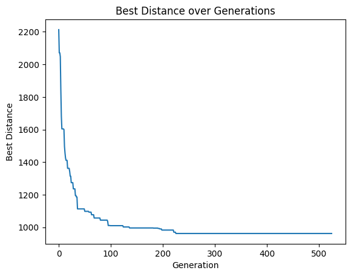
    


```python
if __name__ == "__main__":
    cities = 25
    population = 100
    generation  = 0
    max_generations = math.inf
    mutation_rate = 0.50
    eliteSize= 5
    cityList = generate_cities(cities)
    
    print(f"Cities: {cities} Population: {population} Generations: {max_generations} Mutation Rate: {mutation_rate*100}% Elite Size= {eliteSize} \n\n\n")
    population = create_Initial_Population(population,cities)
    fitnessArray = fitness(population,cityList)
    bestSolution, bestDistance = best_fitness(population, fitnessArray)

    # Create a list to store the best distances for each generation
    bestDistances = [bestDistance]

    DistanceList = []
    while generation < max_generations:
        population, fitnessArray, bestSolution, bestDistance = evolution(population, fitnessArray, mutation_rate,cityList,eliteSize)
      
        
        # Add the new bestDistance to the list
        DistanceList.append(bestDistance)
        bestDistances.append(bestDistance)

        # If there are more than 300 distances in the list, remove the oldest one
        if len(DistanceList) > 300:
            DistanceList.pop(0)
        
        # Check if all distances in the list are the same, but only after 300 generations
        if generation >= 300 and len(set(DistanceList)) == 1:
            break

        generation += 1

    # Plotting the best distances
    plt.plot(bestDistances)
    plt.xlabel('Generation')
    plt.ylabel('Best Distance')
    plt.title('Best Distance over Generations')
    plt.show()
```

    Cities: 25 Population: 100 Generations: inf Mutation Rate: 50.0% Elite Size= 5 
    
    
    
    


    
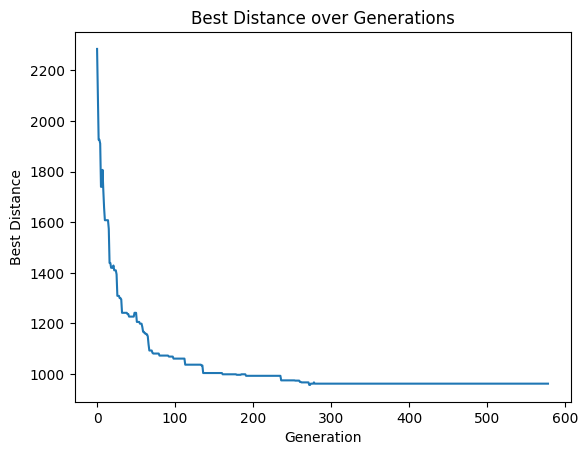
    


```python
if __name__ == "__main__":
    cities = 25
    population = 200
    generation  = 0
    max_generations = math.inf
    mutation_rate = 0.05
    eliteSize= 5
    cityList = generate_cities(cities)
    
    print(f"Cities: {cities} Population: {population} Generations: {max_generations} Mutation Rate: {mutation_rate*100}% Elite Size= {eliteSize} \n\n\n")
    population = create_Initial_Population(population,cities)
    fitnessArray = fitness(population,cityList)
    bestSolution, bestDistance = best_fitness(population, fitnessArray)

    # Create a list to store the best distances for each generation
    bestDistances = [bestDistance]

    DistanceList = []
    while generation < max_generations:
        population, fitnessArray, bestSolution, bestDistance = evolution(population, fitnessArray, mutation_rate,cityList,eliteSize)
      
        
        # Add the new bestDistance to the list
        DistanceList.append(bestDistance)
        bestDistances.append(bestDistance)

        # If there are more than 300 distances in the list, remove the oldest one
        if len(DistanceList) > 300:
            DistanceList.pop(0)
        
        # Check if all distances in the list are the same, but only after 300 generations
        if generation >= 300 and len(set(DistanceList)) == 1:
            break

        generation += 1

    # Plotting the best distances
    plt.plot(bestDistances)
    plt.xlabel('Generation')
    plt.ylabel('Best Distance')
    plt.title('Best Distance over Generations')
    plt.show()
```

    Cities: 25 Population: 200 Generations: inf Mutation Rate: 5.0% Elite Size= 5 
    
    
    
    


    
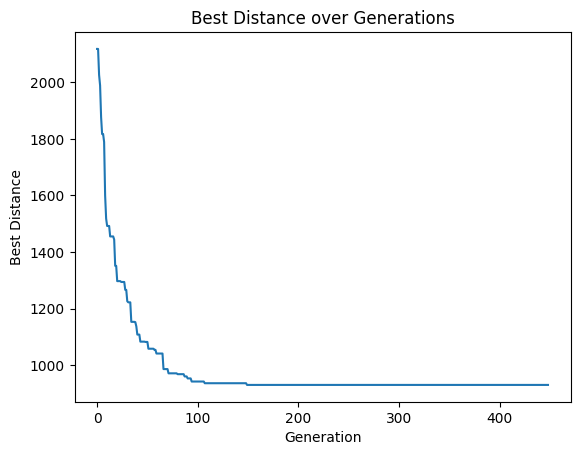
    


```python
if __name__ == "__main__":
    cities = 25
    population = 200
    generation  = 0
    max_generations = math.inf
    mutation_rate = 0.05
    eliteSize= 5
    cityList = generate_cities(cities)
    
    print(f"Cities: {cities} Population: {population} Generations: {max_generations} Mutation Rate: {mutation_rate*100}% Elite Size= {eliteSize} \n\n\n")
    population = create_Initial_Population(population,cities)
    fitnessArray = fitness(population,cityList)
    bestSolution, bestDistance = best_fitness(population, fitnessArray)

    # Create a list to store the best distances for each generation
    bestDistances = [bestDistance]

    DistanceList = []
    while generation < max_generations:
        population, fitnessArray, bestSolution, bestDistance = evolution(population, fitnessArray, mutation_rate,cityList,eliteSize)
      
        
        # Add the new bestDistance to the list
        DistanceList.append(bestDistance)
        bestDistances.append(bestDistance)

        # If there are more than 300 distances in the list, remove the oldest one
        if len(DistanceList) > 300:
            DistanceList.pop(0)
        
        # Check if all distances in the list are the same, but only after 300 generations
        if generation >= 300 and len(set(DistanceList)) == 1:
            break

        generation += 1

    # Plotting the best distances
    plt.plot(bestDistances)
    plt.xlabel('Generation')
    plt.ylabel('Best Distance')
    plt.title('Best Distance over Generations')
    plt.show()
```

    Cities: 25 Population: 200 Generations: inf Mutation Rate: 5.0% Elite Size= 5 
    
    
    
    


    
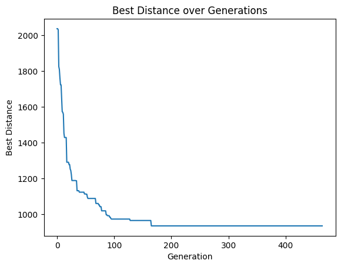
    


```python
if __name__ == "__main__":
    cities = 50
    population = 200
    generation  = 0
    max_generations = math.inf
    mutation_rate = 0.05
    eliteSize= 5
    cityList = generate_cities(cities)
    
    print(f"Cities: {cities} Population: {population} Generations: {max_generations} Mutation Rate: {mutation_rate*100}% Elite Size= {eliteSize} \n\n\n")
    population = create_Initial_Population(population,cities)
    fitnessArray = fitness(population,cityList)
    bestSolution, bestDistance = best_fitness(population, fitnessArray)

    # Create a list to store the best distances for each generation
    bestDistances = [bestDistance]

    DistanceList = []
    while generation < max_generations:
        population, fitnessArray, bestSolution, bestDistance = evolution(population, fitnessArray, mutation_rate,cityList,eliteSize)
      
        
        # Add the new bestDistance to the list
        DistanceList.append(bestDistance)
        bestDistances.append(bestDistance)

        # If there are more than 300 distances in the list, remove the oldest one
        if len(DistanceList) > 300:
            DistanceList.pop(0)
        
        # Check if all distances in the list are the same, but only after 300 generations
        if generation >= 300 and len(set(DistanceList)) == 1:
            break

        generation += 1

    # Plotting the best distances
    plt.plot(bestDistances)
    plt.xlabel('Generation')
    plt.ylabel('Best Distance')
    plt.title('Best Distance over Generations')
    plt.show()
```

    Cities: 50 Population: 200 Generations: inf Mutation Rate: 5.0% Elite Size= 5 
    
    
    
    


    
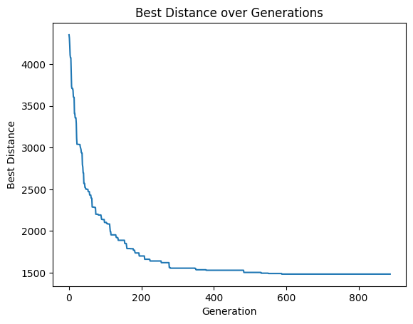
    


<h3>Best Route Per 50 Generation Graph</h3>

<h3>Contribution</h3>
<ul>
Visualization was propose by Quang Le

Implementation was done by Adam Clark with the assistance of Sakib Mahmood
</ul>


```python
if __name__ == "__main__":
    cities = 25
    population = 100
    generation = 0
    max_generations = math.inf
    mutation_rate = 0.05
    eliteSize = 5
    cityList = generate_cities(cities)

    print(f"Cities: {cities} Population: {population} Generations: {max_generations} Mutation Rate: {mutation_rate*100}% Elite Size= {eliteSize} \n\n\n")
    population = create_Initial_Population(population, cities)
    fitnessArray = fitness(population, cityList)
    bestSolution, bestDistance = best_fitness(population, fitnessArray)

    DistanceList = []
    while generation < max_generations:
        population, fitnessArray, bestSolution, bestDistance = evolution(population, fitnessArray, mutation_rate, cityList, eliteSize)

        # Display the graph for every 50 generations
        if generation % 50 == 0:
            plt.figure(figsize=(10, 10))
            for i in range(len(bestSolution) - 1):
                city1 = bestSolution[i]
                city2 = bestSolution[i+1]
                plt.plot(*zip(cityList[city1], cityList[city2]), 'b-')
            plt.plot(*zip(cityList[bestSolution[-1]], cityList[bestSolution[0]]), 'b-')
            plt.scatter(*zip(*cityList.values()), color='red', label='Cities')  # plot the cities
            for city, (x, y) in cityList.items():
                plt.annotate(city, (x, y), textcoords="offset points", xytext=(0, 10), ha='center')
            plt.xlim(0, 200)
            plt.ylim(0, 200)
            plt.title(f"Generation {generation + 1}")
            plt.legend()
            plt.show()
            plt.close()

        # Add the new bestDistance to the list
        DistanceList.append(bestDistance)

        # If there are more than 300 distances in the list, remove the oldest one
        if len(DistanceList) > 300:
            DistanceList.pop(0)

        # Check if all distances in the list are the same, but only after 300 generations
        if generation >= 300 and len(set(DistanceList)) == 1:
            print("The best distance didn't change for the last 300 generations")
            break

        generation += 1

```

    Cities: 25 Population: 100 Generations: inf Mutation Rate: 5.0% Elite Size= 5 
    
    
    
    


    
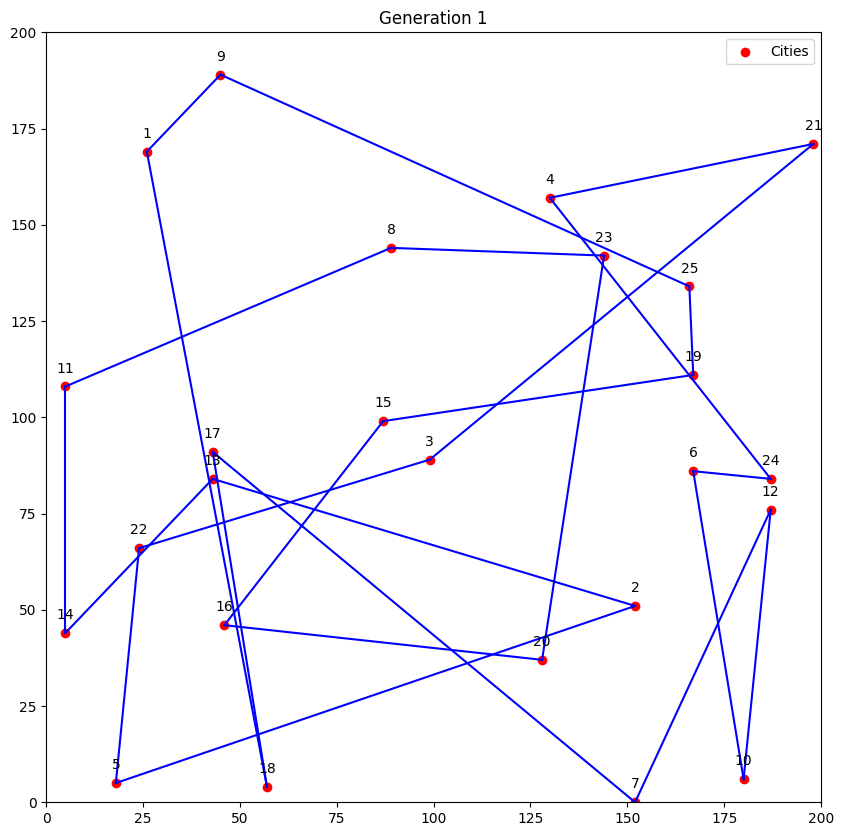
    


    
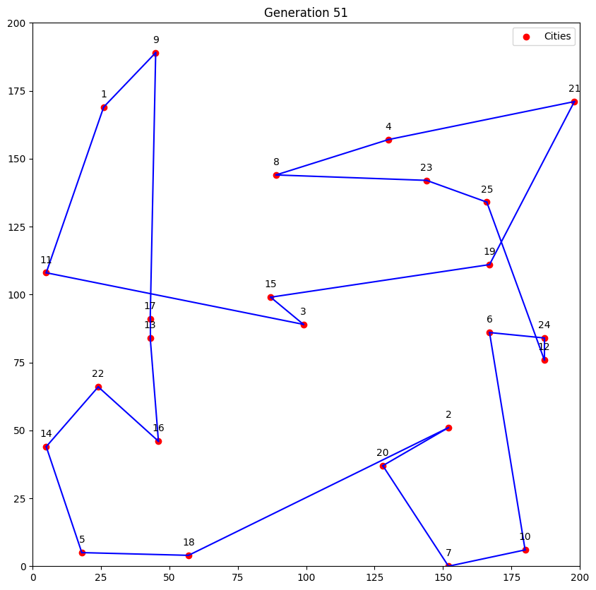
    


    
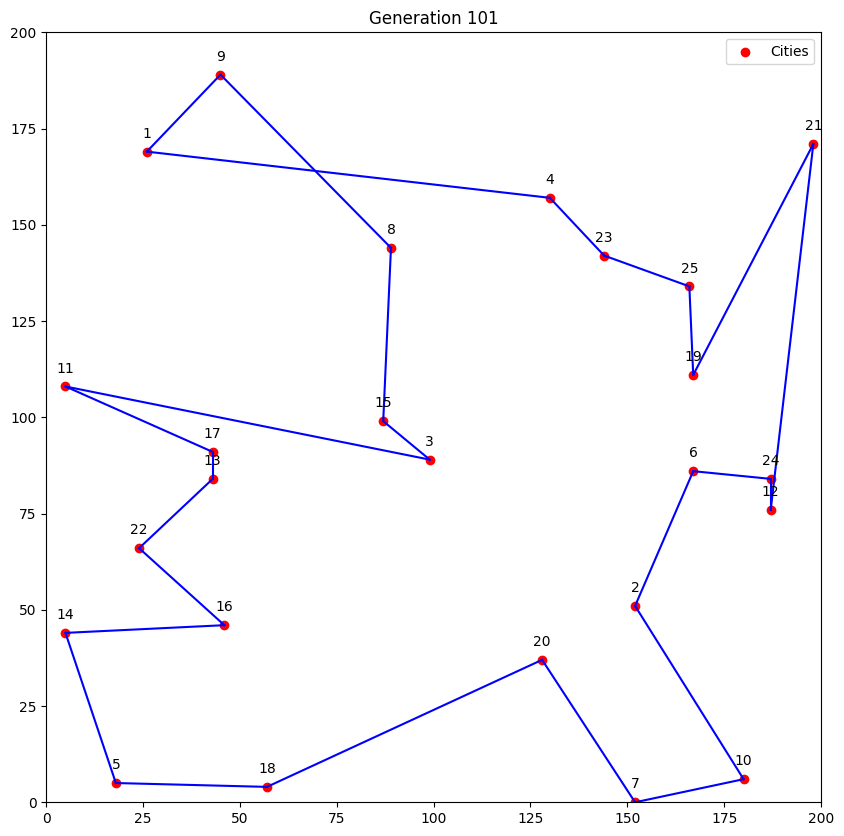
    


    

    


    
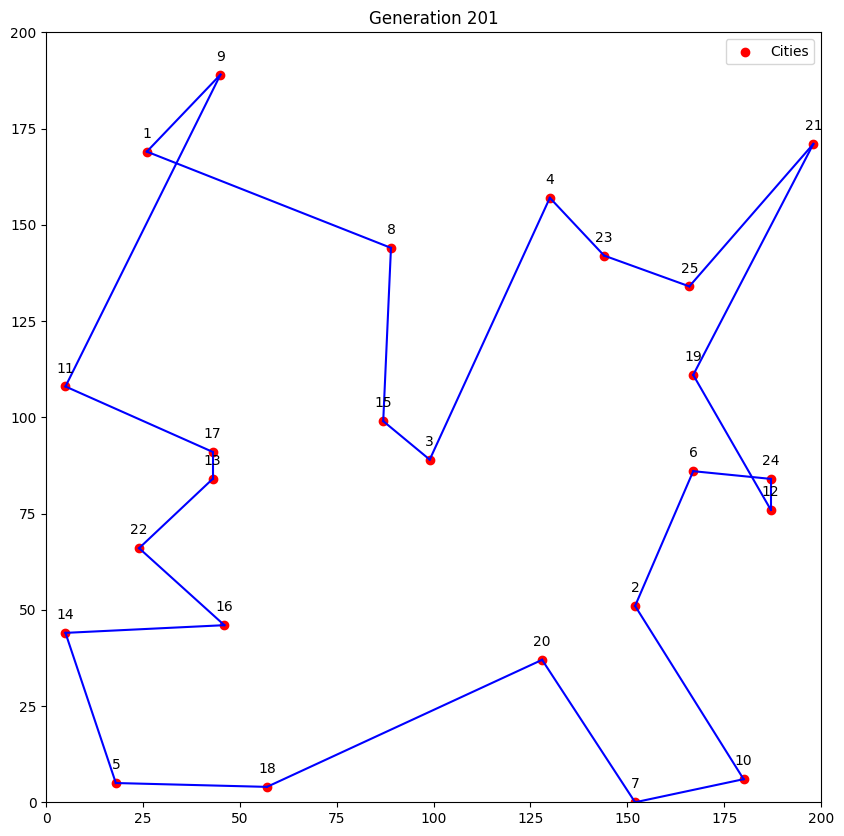
    


    

    


    

    


    
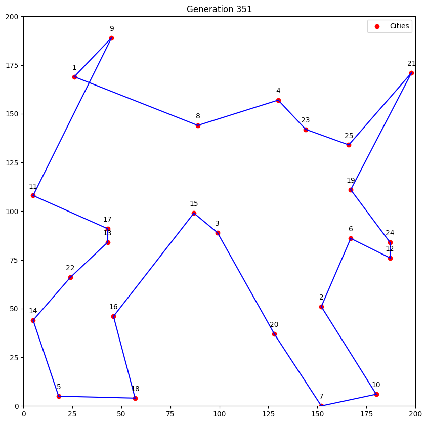
    


    
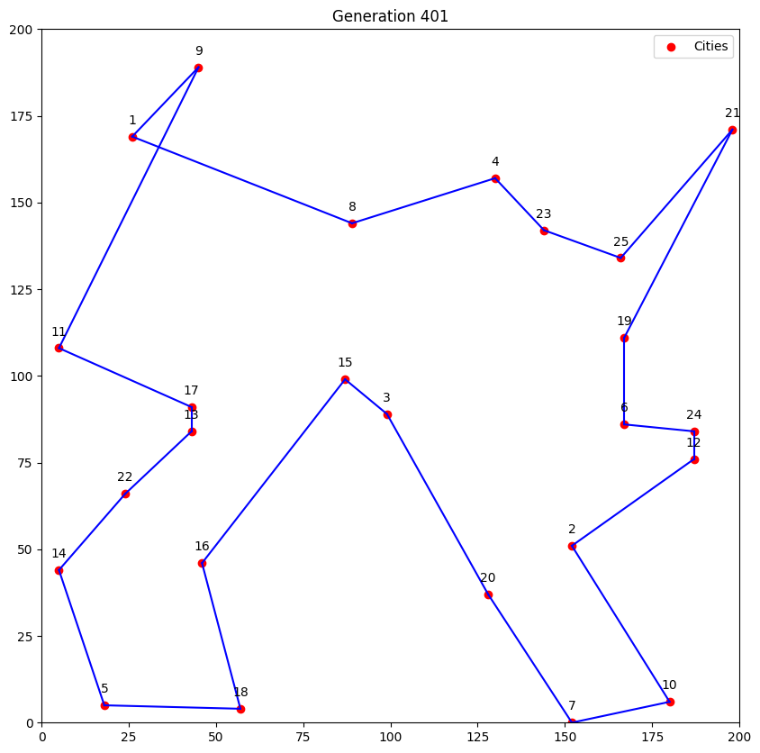
    


    
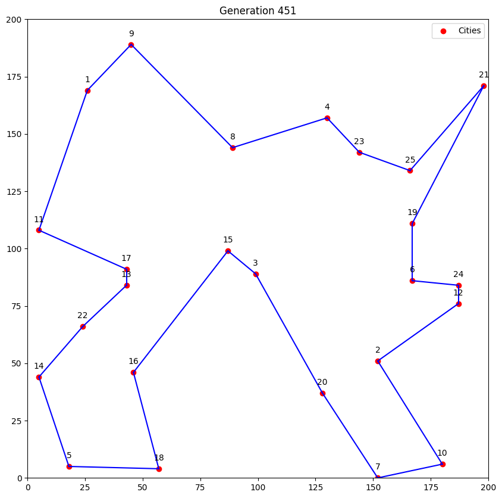
    


    

    


    

    


    
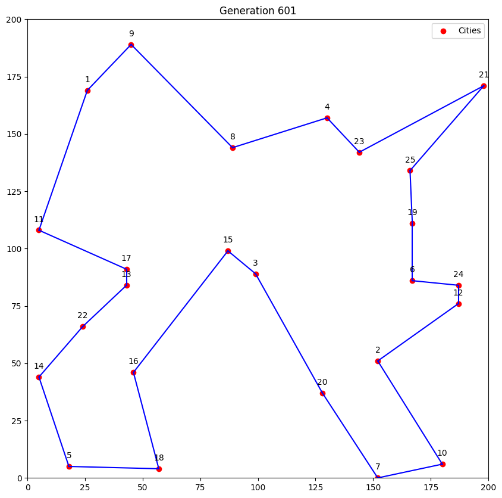
    


    

    


    

    


    

    


    

    


    The best distance didn't change for the last 300 generations
    

<h3>Refrences</h3>


OOP solution (in Python) by Eric Stoltz: https://towardsdatascience.com/evolution-of-a-salesman-a-complete-genetic-algorithm-tutorial-for-python-6fe5d2b3ca35
